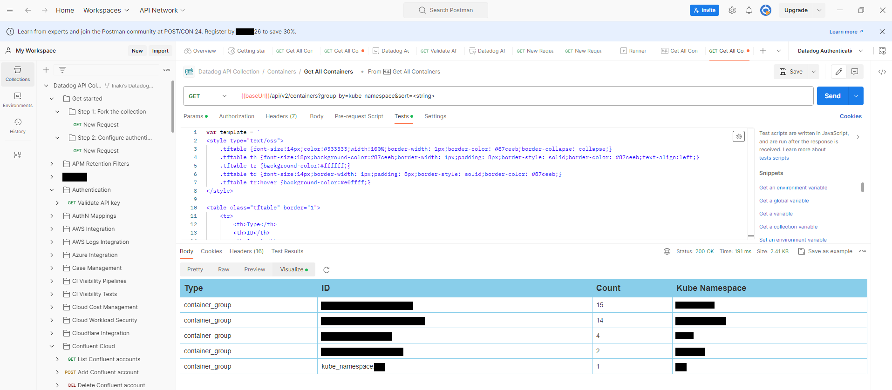

# Procedimiento de instalación y configuración de Datadog Agent en Openshift

> [!NOTE]
> **Uso de IA**:
> - 💻 **Código**: Todo el código de este repositorio ha sido generado **sin ayuda de la IA**.
> - 📝 **Documentación**: Este fichero en español es el **original escrito a mano**. Recientemente se ha utilizado IA (incluyendo NotebookLM) para generar la documentación en inglés y el README principal.

---

## 🤖 Resúmenes generados por IA (NotebookLM)
Obtén una visión rápida de este repositorio a través de contenido generado por IA:
- 📽️ [**Video Resumen (Español)**](resources/ai-summaries/Datadog_Operator_Spanish.mp4): Resumen técnico sobre el uso del Datadog Operator en OpenShift.
- 📽️ [**Video Summary (Inglés)**](resources/ai-summaries/Datadog_on_OpenShift_English.mp4): Una visión técnica de alto nivel del proyecto.
- 📊 [**Presentación Técnica (PDF)**](resources/ai-summaries/Datadog_OpenShift_Technical_Blueprint.pdf): Plano detallado y visión general de la arquitectura.
- 📊 [**Presentación Técnica (PPTX)**](resources/ai-summaries/Datadog_OpenShift_Technical_Blueprint.pptx): Versión editable en PowerPoint del plano técnico.

---

1. [Introducción](#introducción)
2. [Requisitos](#requisitos)
3. [Debugging VS Tracing VS Profiling](#debugging-vs-tracing-vs-profiling)
4. [Funcionalidades y Control de Costes](#funcionalidades-y-control-de-costes)
5. [Añadir trazas de Kubernetes APM con Datadog Admission Crontroller](#añadir-trazas-de-kubernetes-apm-con-datadog-admission-crontroller)
   1. [Habilitar Datadog Admission Controller para mutar tus PODs sin hacer uso de POD labels](#habilitar-datadog-admission-controller-para-mutar-tus-pods-sin-hacer-uso-de-pod-labels)
   2. [Labels y Annotations en el POD que queremos instrumentalizar sin inyección automática de librerías Datadog APM (no recomendable)](#labels-y-annotations-en-el-pod-que-queremos-instrumentalizar-sin-inyección-automática-de-librerías-datadog-apm-no-recomendable)
   3. [Labels y Annotations en el POD que queremos instrumentalizar con inyección automática de librerías Datadog APM. Unified Service Tagging para facilitar la gobernanza con etiquetas](#labels-y-annotations-en-el-pod-que-queremos-instrumentalizar-con-inyección-automática-de-librerías-datadog-apm-unified-service-tagging-para-facilitar-la-gobernanza-con-etiquetas)
   4. [Habilitar el Profiler](#habilitar-el-profiler)
   5. [Autodiscovery con JMX](#autodiscovery-con-jmx)
      1. [Autodiscovery annotations (recomendable)](#autodiscovery-annotations-recomendable)
   6. [Configuración de logging. features.logCollection.containerCollectAll VS Autodiscovery](#configuración-de-logging-featureslogcollectioncontainercollectall-vs-autodiscovery)
   7. [PoC de Datadog APM con demo](#poc-de-datadog-apm-con-demo)
6. [Mejora en las métricas de kubernetes con kube-state-metrics](#mejora-en-las-métricas-de-kubernetes-con-kube-state-metrics)
7. [Datadog Tags con Autodiscovery y Unified Service Tagging](#datadog-tags-con-autodiscovery-y-unified-service-tagging)
   1. [Extracción de Kubernetes Tags](#extracción-de-kubernetes-tags)
      1. [Kubernetes Host Tags](#kubernetes-host-tags)
   2. [Variables de Entorno definidas en Datadog Agent de MyOrg](#variables-de-entorno-definidas-en-datadog-agent-de-example-company)
   3. [FinOps. Control de Costes de Datadog por etiquetas](#finops-control-de-costes-de-datadog-por-etiquetas)
8. [QoS en Datadog Agent](#qos-en-datadog-agent)
9. [Datadog Service Catalog](#datadog-service-catalog)
10. [Kubernetes Capacity Planning Dashboard](#kubernetes-capacity-planning-dashboard)
11. [Datadog API Tools](#datadog-api-tools)
    1. [Dogshell CLI (no recomendable)](#dogshell-cli-no-recomendable)
    2. [curl CLI (no recomendable)](#curl-cli-no-recomendable)
    3. [Datadog Postman API Collection](#datadog-postman-api-collection)
12. [Instrumentation (Traces, Metrics and Logs)](#instrumentation-traces-metrics-and-logs)
    1. [Single Step APM Instrumentation (Beta)](#single-step-apm-instrumentation-beta)
    2. [Dynamic instrumentation](#dynamic-instrumentation)
    3. [Configuración de Java Tracing Library](#configuración-de-java-tracing-library)
13. [Log Management](#log-management)
    1. [Log Configuration Pipelines](#log-configuration-pipelines)
    2. [Correlación de logs y trazas](#correlación-de-logs-y-trazas)
       1. [Automatic injection. Automatically Inject trace IDs and Span IDs into your logs](#automatic-injection-automatically-inject-trace-ids-and-span-ids-into-your-logs)
       2. [Java Log Collection](#java-log-collection)
    3. [Observability Pipelines](#observability-pipelines)
14. [Profiling en Java](#profiling-en-java)
15. [Remote Configuration](#remote-configuration)
16. [Configuración avanzada de prometheus autodiscovery con Datadog agent (prometheusScrape)](#configuración-avanzada-de-prometheus-autodiscovery-con-datadog-agent-prometheusscrape)
17. [Kubernetes Control Plane Monitoring](#kubernetes-control-plane-monitoring)
    1. [API Server](#api-server)
    2. [Etcd](#etcd)
    3. [Controller Manager](#controller-manager)
    4. [Scheduler](#scheduler)
18. [Kubernetes Audit Logs. Activate log collection in kubernetes](#kubernetes-audit-logs-activate-log-collection-in-kubernetes)
19. [Datadog Wizard para configurar con YAML el contenedor de la aplicación para APM](#datadog-wizard-para-configurar-con-yaml-el-contenedor-de-la-aplicación-para-apm)
20. [Referencias](#referencias)
    1. [Kubernetes Security Context](#kubernetes-security-context)
    2. [Instalación de Datadog Agent Helm Chart](#instalación-de-datadog-agent-helm-chart)
    3. [Facturación de Datadog](#facturación-de-datadog)
    4. [Referencias de Datadog Operator](#referencias-de-datadog-operator)
       1. [Instalación de Datadog Operator via OpenShift Marketplace](#instalación-de-datadog-operator-via-openshift-marketplace)
       2. [Instalación de Datadog Operator Helm Chart](#instalación-de-datadog-operator-helm-chart)
    5. [Referencias de Kubernetes APM con Datadog](#referencias-de-kubernetes-apm-con-datadog)
    6. [Profiling vs Tracing](#profiling-vs-tracing)

## Introducción

Existen [varios procedimientos](https://docs.datadoghq.com/containers/kubernetes/installation) de instalación de Datadog Agent en Openshift[^7]:
1. [ ] [Solución 1](solution-1-helm-chart/README.md). Hacemos uso del Helm Chart de **Datadog Agent**: 
   1. Helm Chart para desplegar *Datadog Agent* en OpenShift 4.x: https://github.com/DataDog/helm-charts/tree/main/charts/datadog
   2. Desplegar el Agente de Datadog con un simple *[values.yaml](solution-1-helm-chart/values.yaml)* asociado a su Helm Chart.
   3. Será necesario aplicar el manifiesto [scc.yaml](solution-1-helm-chart/scc.yaml) de clase ```SecurityContextConstraints``` para habilitar el conjunto completo de características del Agente de Datadog: ```oc apply -f scc.yaml```
2. [x] [Solución 2](solution-2-operator/README.md). En principio éste sería el procedimiento más recomendable por los beneficios que aportan los Operadores de Kubernetes, aunque en este caso encontramos menos documentación. Hacemos uso de **Datadog Operator** (un [*Kubernetes Operator*](https://www.redhat.com/en/topics/containers/what-is-a-kubernetes-operator)):
   1. Tres opciones disponibles para desplegar **Datadog Operator**:
        1. [ ] Opción A: Instalación manual con 1 click en Openshift Marketplace: [*Deploy the Datadog Operator in an OpenShift cluster*](https://github.com/DataDog/datadog-operator/blob/main/docs/install-openshift.md)
        2. [ ] Opción B: [Helm Chart](https://github.com/DataDog/helm-charts/blob/main/charts/datadog-operator) para desplegar *Datadog Operator* en OpenShift 4.x: Intento de configuración disponible en [solution-2-operator/datadog-operator-helm-chart/values.yaml](solution-2-operator/datadog-operator-helm-chart/values.yaml)
        3. [x] **Opción C:** Manifiesto [operatorhubio-catalog.yaml](solution-2-operator/datadog-operator-olm/operatorhubio-catalog.yaml) y [datadog-olm.yaml](solution-2-operator/datadog-operator-olm/datadog-olm.yaml) de [Operator Lifecycle Manager (OLM)](https://operatorhub.io/operator/datadog-operator) con el que subscribirse al operador de datadog:
           1. ```oc create secret -n openshift-operators generic datadog-secret --from-literal api-key=<> --from-literal app-key=<>```
           2. ```oc apply -f operatorhubio-catalog.yaml```
           3. ```oc apply -f datadog-olm.yaml```
   2. Tras poner en marcha el operador, podemos proceder con **Datadog Agent** mediante un manifiesto YAML que incluye el CRD definido por el operador. Desplegamos el manifiesto de *DatadogAgent* [datadog-agent-on-openshift.yaml](solution-2-operator/datadog-agent-on-openshift.yaml) adaptado a las necesidades de MyOrg:
        1. [x] ```oc apply -f datadog-agent-on-openshift.yaml```
        2. [x] Aplicamos el manifiesto [scc.yaml](solution-2-operator/scc.yaml) de clase ```SecurityContextConstraints``` para habilitar el conjunto completo de características del Agente de Datadog: ```oc apply -f scc.yaml```
        3. Desinstalación: ```oc delete -f datadog-agent-on-openshift.yaml; oc delete -f scc.yaml```
3. [ ] Solución 3 (descartado). Instalación manual y configuración del Agente de Datadog con DaemonSet.

[^7]: https://www.datadoghq.com/blog/openshift-monitoring-with-datadog/

**El método de instalación implementado en MyOrg corresponde a la "Solución 2" con la "Opción C".**

**Datadog está desplegado en OCP Prod desde el 05 de mayo de 2026. Se descarta su despliegue en OCP NoProd**

## Requisitos

- Cuenta de usuario en Datadog Cloud con:
  - [x] API-Key (obligatorio)
  - [ ] app-key (opcional)
- Creación de namespace/project en OpenShift:
  - [ ] En el caso de [Solución 1](solution-1-helm-chart/README.md): Namespace dedicado en kubernetes para datadog, por ejemplo **datadog**.
  - [x] En la [Solución 2](solution-2-operator/README.md) utilizamos el ya existente namespace de **openshift-operators**
- Creación de un *secret* en nuestro namespace para que openshift pueda hacer login en *DockerHub*, necesario para descargar las librerías APM[^1] que deben ser inyectadas automáticamente[^2], tal y como se indica en la [referencia](https://docs.openshift.com/container-platform/4.13/openshift_images/image-streams-manage.html):
  - [x] ```oc create secret docker-registry dockerhub-secret -n <> --docker-server=https://registry.hub.docker.com/v2 --docker-username=<> --docker-password=<> --docker-email=<>@example.com```
  - [x] ```oc secrets link default dockerhub-secret --for=pull -n <>```

[^1]: https://docs.datadoghq.com/tracing/trace_collection/library_injection_local/?tab=kubernetes

[^2]: https://www.docker.com/increase-rate-limit

## Debugging VS Tracing VS Profiling

- **Debugging** is the process of looking for bugs and their cause in applications. a bug can be an error or just some unexpected behaviour (e.g. a user complains that he/she receives an error when he/she uses an invalid date format). typically a debugger is used that can pause the execution of an application, examine variables and manipulate them.
- **Tracing** *"trace is a log of events within to the program"*(Whitham)[^27]. those events can be ordered chronologically. thats why they often contain a timestamp. Tracing is the process of generating and collecting those events. the use case is typically flow analysis.
- **Profiling** is a dynamic analysis process that collects information about the execution of an application. the type of information that is collected depends on your use case, e.g. the number of requests. the result of profiling is a profile with the collected information. the source for a profile can be exact events (see tracing below) or a sample of events that occured. because the data is aggregated in a profile it is irrelevant when and in which order the events happened.

Trace:

```bash
[2026-05-05T11:22:09.815479Z] [INFO] [Thread-1] Request started
[2026-05-05T11:22:09.935612Z] [INFO] [Thread-1] Request finished
[2026-05-05T11:22:59.344566Z] [INFO] [Thread-1] Request started
[2026-05-05T11:22:59.425697Z] [INFO] [Thread-1] Request finished
```

Profile:

```bash
2 "Request finished" Events
2 "Request started" Events
```

So if tracing and profiling measure the same events you can construct a profile from a trace but not the other way around.

[^27]: https://www.jwhitham.org/2016/02/profiling-versus-tracing.html

## Funcionalidades y Control de Costes

Muchas de las funcionalidades que podemos habilitar en nuestro Datadog Agent implican la subscrición a un producto específico de Datadog. Por ejemplo la monitorización de *Live Processes* requiere la subscripción de *Infrastructure -> Enterprise plan*.

https://www.datadoghq.com/pricing/allotments/

## Añadir trazas de Kubernetes APM con Datadog Admission Crontroller

[*Datadog Admission Controller*](https://docs.datadoghq.com/containers/cluster_agent/admission_controller/?tab=helm) es un componente del *Datadog Cluster Agent* que simplifica la configuración de un POD de aplicación.

Utilizamos *Datadog Admission Controller* para inyectar variables de entorno y montar los volúmenes necesarios en los nuevos PODs de aplicación, configurando automáticamente la comunicación de trazas entre el POD y el Agente. Éste controlador se encarga de **inyectar automáticamente** las librerías de *trazabilidad APM*, como por ejemplo el [*Java Tracer*](https://docs.datadoghq.com/tracing/trace_collection/automatic_instrumentation/dd_libraries/java) para java.

EL APM de Datadog [está habilitado por defecto](https://github.com/DataDog/helm-charts/blob/e5284d563b635628aa5650b827e16a2e15063b4e/charts/datadog/values.yaml) sobre *Unix Domain Socket (UDS)*. Es necesario cambiar la comunicación con el Agente de Datadog de *"socket"* a *"hostip"*. Según la siguiente [referencia](https://docs.datadoghq.com/containers/troubleshooting/admission-controller/?tab=helm#application-pods-are-not-created):

> Admission Controller’s injection mode (socket, hostip, service) is set by the configuration of your Cluster Agent. For example, if you have socket mode enabled in your Agent, Admission Controller also uses socket mode.
> **If you are using GKE Autopilot or OpenShift, you need to use a specific injection mode.**

Según esta otra [documentación de Openshift](https://docs.datadoghq.com/integrations/openshift/?tab=helm#restricted-scc-operations):

> If the Operator has been deployed with Operator Lifecycle Manager (OLM), then the necessary default SCCs present in OpenShift are automatically associated with the datadog-agent-scc ServiceAccount. The Agent can then be deployed with the DatadogAgent CustomResourceDefinition, referencing this Service Account on the Node Agent and Cluster Agent pods.

> The recommended ingestion method for Dogstatsd, APM, and logs is to bind the Datadog Agent to a host port. This way, the target IP is constant and easily discoverable by your applications. The default restricted OpenShift SCC does not allow binding to the host port. You can set the Agent to listen on it’s own IP, but you need to handle the discovery of that IP from your application.

Por lo tanto, aplicamos unos permisos SCC específicos para el *Service Account* de Datadog (datadog-agent-scc), ubicados en el fichero [scc.yaml](solution-2-operator/scc.yaml).

Hay que también tener en cuenta que por defecto los PODs lanzados en OpenShift se identifican con el *"default"* Service Account (SA) de OpenShift, el cual está vinculado con el "restricted-v2" SCC. Es por este motivo que resulta más eficaz establecer la conexión via "hostip" para evitar crear un SCC específico para todos los PODs que queramos monitorizar con Datadog (nota: no es conveniente modificar los SCC por defecto).

### Habilitar Datadog Admission Controller para mutar tus PODs sin hacer uso de POD labels

Por defecto, *Datadog Admission Controller* sólo muta los pods etiquetados con una etiqueta específica. Para [habilitar la mutación de tus pods](https://docs.datadoghq.com/tracing/trace_collection/library_injection_local/?tab=kubernetes#step-1---enable-datadog-admission-controller-to-mutate-your-pods) se añade la etiqueta (*label*) ```admission.datadoghq.com/enabled: "true"``` a la especificación (*spec*) de tu pod:

```yaml
labels:
  admission.datadoghq.com/enabled: true
```

**En MyOrg no es necesario hacer uso de esta etiqueta de POD**. En su lugar habilitamos en *Datadog Admission Controller* la inyección automática de trazas APM configurando *Datadog Cluster Agent*[^8] con ```clusterAgent.admissionController.mutateUnlabelled: "true"``` (o ```DD_ADMISSION_CONTROLLER_MUTATE_UNLABELLED=true```).

[^8]: Un componente de *Datadog Agent*

### Labels y Annotations en el POD que queremos instrumentalizar sin inyección automática de librerías Datadog APM (no recomendable)

En aquellos casos de uso donde las librerías APM no puedan ser inyectadas automáticamente por [*Datadog Admission Controller*](https://docs.datadoghq.com/containers/cluster_agent/admission_controller/), será necesario activar la monitorización APM de nuestros PODs mediante [la siguiente configuración](https://www.datadoghq.com/blog/auto-instrument-kubernetes-tracing-with-datadog/):

```yaml
labels:
  admission.datadoghq.com/enabled: true
  admission.datadoghq.com/config.mode: "hostip"
annotations:
  admission.datadoghq.com/java-lib.version: "latest"
```

### Labels y Annotations en el POD que queremos instrumentalizar con inyección automática de librerías Datadog APM. Unified Service Tagging para facilitar la gobernanza con etiquetas

Una vez hemos activado la inyección automática de liberías APM en [*Datadog Admission Controller*](https://docs.datadoghq.com/containers/cluster_agent/admission_controller/), podemos instrumentalizar nuestras aplicaciones de la siguiente manera[^4], incluyendo el [*Unified Service Tagging*](https://docs.datadoghq.com/getting_started/tagging/unified_service_tagging/):

```yaml
apiVersion: apps/v1
kind: Deployment
metadata:
  name: myapp
  namespace: mynamespace
  labels: 
    tags.datadoghq.com/env: "dev" # Configuring unified service tagging (variable de entorno para facilitar la gobernanza de recursos monitorizados)
    tags.datadoghq.com/service: "<myServiceID>" # Configuring unified service tagging (etiqueta que facilita la gobernanza de recursos monitorizados)
    tags.datadoghq.com/version: "1" # Configuring unified service tagging (etiqueta que facilita la gobernanza de recursos monitorizados)
spec:
  # (...)
  selector:
    matchLabels:
      name: myapp
  # (...)      
  template:
    metadata:
      labels: 
        name: myapp
        tags.datadoghq.com/env: "dev" # Configuring unified service tagging
        tags.datadoghq.com/service: "<myServiceID>" # Configuring unified service tagging
        tags.datadoghq.com/version: "1" # Configuring unified service tagging
      annotations:
        admission.datadoghq.com/java-lib.version: "latest"
# (...)
---
apiVersion: v1
kind: Service
metadata:
  name: myapp
  namespace: mynamespace
spec:
  # (...)
  selector:
    name: myapp

```

[^4]: https://www.datadoghq.com/blog/auto-instrument-kubernetes-tracing-with-datadog/

### Habilitar el Profiler

Habilitamos el *java profiler*[^5] añadiendo la variable de entorno *DD_PROFILING_ENABLED* a nuestro contenedor java[^6]:

```yaml
# (...)
apiVersion: apps/v1
kind: Deployment
metadata:
   # (...)
spec:
   # (...)
  template:
    metadata:
      labels:
         # (...)
      annotations:
         # (...)
    spec:
      containers:
      - image: # (...)
         # (...)
         env:
         - name: DD_PROFILING_ENABLED # https://docs.datadoghq.com/profiler/enabling/java/?tab=datadogprofiler
           value: 'true'
         ports:
         - containerPort: # (...)
# (...)
```

[^5]: https://docs.datadoghq.com/profiler/enabling/

[^6]: https://docs.datadoghq.com/getting_started/profiler/

### Autodiscovery con JMX

En entornos containerizados existen pocas diferencias en cómo el Agente se conecta al servidor JMX. Las funcionalidades de *Autodiscovery* hacen posible la configuración dinámica de estas integraciones. Utilizaremos las integraciones basadas en el JMX de Datadog para recoger las métricas de aplicaciones JMX de los pods en Kubernetes.

Si habilitamos *java tracer* en nuestras aplicaciones, alternativamente podemos hacer uso de la funcionalidad de métricas del *java runtime* para enviar estas métricas al Agente.

```yaml
apiVersion: datadoghq.com/v2alpha1
kind: DatadogAgent
metadata:
  name: datadog
spec:
  #(...)
  override:
    nodeAgent:
      image:
        jmxEnabled: true
```

#### Autodiscovery annotations (recomendable)

En este método[^13], la configuración ```JMX check``` se aplica utilizando anotactiones en los PODs basados en java. Esto permite al Agente la configuración automátca del ```JMX check``` cuando un contenedor arranca. Estas anotaciones han de estar en el Pod creado, y no en el objeto que crea el Pod (Deployment, DaemonSet, etc.).

Utilizamos la siguiente plantilla para las anotaciones de *Autodiscovery*:

Nota: Reemplazar *<INTEGRATION_NAME>* por uno de las [integraciones JMX disponibles](https://docs.datadoghq.com/containers/guide/autodiscovery-with-jmx/?tab=operator#available-jmx-integrations).
Nota 2: Mediante estas anotaciones podemos integrar las *JMX Custom Metrics* en *Datadog Metrics*, siendo necesario especificar en el manifiesto de abajo cada una de las métricas a añadir. En este caso no parece haber una configuración genérica que permita el *discovery* automático de todas esas *JMX Custom Metrics*. Otra opción interesante sería las *Prometheus Custom Metrics* detalladas en el capítulo de [Configuración avanzada de prometheus autodiscovery con Datadog agent (prometheusScrape)](#configuración-avanzada-de-prometheus-autodiscovery-con-datadog-agent-prometheusscrape), que sí permite una mayor automatización sin llegar a ser necesario añadir en nuestros manifiestos cada una de las *custom metrics*.

```yaml
apiVersion: v1
kind: Pod
metadata:
  name: <POD_NAME>
  annotations:
    ad.datadoghq.com/<CONTAINER_IDENTIFIER>.checks: |
      {
        "<INTEGRATION_NAME>": {
          "init_config": {
            "is_jmx": true,
            "collect_default_metrics": true
          },
          "instances": [{
            "host": "%%host%%",
            "port": "<JMX_PORT>"
          }]
        }
      }      
    # (...)
spec:
  containers:
    - name: '<CONTAINER_IDENTIFIER>'
      # (...)
      env:
        - name: POD_IP
          valueFrom:
            fieldRef:
              fieldPath: status.podIP
        - name: JAVA_OPTS
          value: >-
            -Dcom.sun.management.jmxremote
            -Dcom.sun.management.jmxremote.authenticate=false
            -Dcom.sun.management.jmxremote.ssl=false
            -Dcom.sun.management.jmxremote.local.only=false
            -Dcom.sun.management.jmxremote.port=<JMX_PORT>
            -Dcom.sun.management.jmxremote.rmi.port=<JMX_PORT>
            -Djava.rmi.server.hostname=$(POD_IP)            
```

[^13]: https://docs.datadoghq.com/containers/guide/autodiscovery-with-jmx/?tab=operator

### Configuración de logging. features.logCollection.containerCollectAll VS Autodiscovery

[Esta referencia](https://app.datadoghq.eu/logs/onboarding/container) resulta útil para iniciarse en la ingesta de logs de contenedores.

See the [sample manifest with logs and metrics collection enabled](https://github.com/DataDog/datadog-operator/blob/main/examples/datadogagent/v2alpha1/datadog-agent-with-logs-apm.yaml) for a complete example. You can set ```features.logCollection.containerCollectAll``` to ```true``` to collect logs from all discovered containers by default. When set to ```false``` (default), you need to specify Autodiscovery log configurations to enable log collection.

Autodiscovery enables you to use templates to configure log collection (and other capabilities) on containers.

Podemos configurar las reglas de procesamiento del logging con el siguiente método[^12] [^20]:

```yaml
apiVersion: v1
kind: Pod
# (...)
metadata:
  name: '<POD_NAME>'
  annotations:
    ad.datadoghq.com/<CONTAINER_IDENTIFIER>.logs: '[<LOG_CONFIG>]'
    # (...)
spec:
  containers:
    - name: '<CONTAINER_IDENTIFIER>'
# (...)
```

Ejemplo:

```yaml
apiVersion: apps/v1
kind: Deployment
metadata:
  name: myapp
  namespace: mynamespace
  labels: 
    tags.datadoghq.com/env: "dev" # Configuring unified service tagging
    tags.datadoghq.com/service: "<myServiceID>" # Configuring unified service tagging
    tags.datadoghq.com/version: "1" # Configuring unified service tagging
spec:
   # (...)
   template:
    metadata:
      labels: 
        name: myapp
        tags.datadoghq.com/env: "dev" # Configuring unified service tagging
        tags.datadoghq.com/service: "<myServiceID>" # Configuring unified service tagging
        tags.datadoghq.com/version: "1" # Configuring unified service tagging
      annotations:
        admission.datadoghq.com/java-lib.version: "latest"
        ad.datadoghq.com/myapp.logs: '[{"source": "java", "service": "<myServiceID>", "log_processing_rules": [{"type": "multi_line", "name": "log_start_with_date", "pattern" : "\\d{4}-(0?[1-9]|1[012])-(0?[1-9]|[12][0-9]|3[01])"}]}]'
# (...)
```

[^12]: https://docs.datadoghq.com/containers/kubernetes/log/?tab=datadogoperator#configuration
[^20]: https://docs.datadoghq.com/agent/logs/advanced_log_collection/?tab=kubernetes#filter-logs

### PoC de Datadog APM con demo

Se ha validado la correcta configuración del APM de Datadog con la siguiente demo pública a modo de *happy path*: [apm-poc/README.md](apm-poc/README.md).

## Mejora en las métricas de kubernetes con kube-state-metrics

Por defecto, *Datadog Agent* colecciona y muestra un conjunto reducido de métricas de sistema, como por ejemplo CPU, red, disco y uso de memoria. Con una simple configuración en el manifiesto [datadog-agent-on-openshift.yaml](solution-2-operator/datadog-agent-on-openshift.yaml) de nuestro *Datadog Operator*[^11] logramos expandir el conjunto de datos recogidos de kubernetes. Esta configuración consiste en añadir *kube-state-metrics*[^9] al cluster, un componente que proporciona unas métricas más detalladas del estado del cluster.

*kube-state-metrics*[^10] escucha al *Kubernetes API* y genera métricas sobre el estado de los objetos lógicos de kubernetes: estado del nodo, capacidad del nodo (CPU y memoria), número de *desired/available/unavailable/updated* réplicas por despliegue, estado del pod (p.e. *waiting*, *running*, *ready*), etc. En [este enlace](https://docs.datadoghq.com/containers/kubernetes/data_collected/#kube-state-metrics) podemos encontrar un listado completo del número de métricas que Datadog recoge de *kube-state-metrics*.

```yaml
spec:
  features:
      kubeStateMetricsCore:
        enabled: true
      clusterChecks:
        enabled: true
        useClusterChecksRunners: true
```

[^9]: https://www.datadoghq.com/blog/monitor-kubernetes-docker/
[^10]: https://github.com/kubernetes/kube-state-metrics
[^11]: https://github.com/DataDog/datadog-operator/blob/main/docs/kubernetes_state_metrics.md

## Datadog Tags con Autodiscovery y Unified Service Tagging

Datadog recomienda la asignación de *Tags* [con *Autodiscovery* ](https://docs.datadoghq.com/getting_started/tagging/assigning_tags/?tab=containerizedenvironments), método que permite el [*Unified Service Tagging*](https://docs.datadoghq.com/getting_started/tagging/unified_service_tagging), un único punto de configuración que abarca toda la telemetría de Datadog.

Referencia de interés: [Best practices for tagging your infrastructure and applications](https://www.datadoghq.com/blog/tagging-best-practices/)

### Extracción de Kubernetes Tags 

El [Agente de Datadog](solution-2-operator/datadog-agent-on-openshift.yaml)[^16] puede crear y asignar *tags* de todas las métricas, trazas, y logs emitidos por un Pod, basados en sus etiquetas ó anotaciones.

*Datadog Agent* autodescubre y adjunta los *tags* emitidos por los pods o contenedores. El listado de *tags* extraídos automáticamente depende de la [configuración de cardinalidad](https://docs.datadoghq.com/getting_started/tagging/assigning_tags/?tab=containerizedenvironments#environment-variables) del agente:

| TAG                         | CARDINALITY  | SOURCE                                                                | REQUIREMENT                                           |
| :-------------------------- | :----------- | :-------------------------------------------------------------------- | :---------------------------------------------------- |
| container_id                | High         | Pod   status                                                          | N/A                                                   |
| display_container_name      | High         | Pod   status                                                          | N/A                                                   |
| pod_name                    | Orchestrator | Pod   metadata                                                        | N/A                                                   |
| oshift_deployment           | Orchestrator | Pod annotation openshift.io/deployment.name                           | OpenShift environment and pod annotation must exist   |
| kube_ownerref_name          | Orchestrator | Pod   ownerref                                                        | Pod   must have an owner                              |
| kube_job                    | Orchestrator | Pod   ownerref                                                        | Pod   must be attached to a cronjob                   |
| kube_job                    | Low          | Pod   ownerref                                                        | Pod   must be attached to a job                       |
| kube_replica_set            | Low          | Pod   ownerref                                                        | Pod   must be attached to a replica set               |
| kube_service                | Low          | Kubernetes   service discovery                                        | Pod   is behind a Kubernetes service                  |
| kube_daemon_set             | Low          | Pod   ownerref                                                        | Pod   must be attached to a DaemonSet                 |
| kube_container_name         | Low          | Pod   status                                                          | N/A                                                   |
| kube_namespace              | Low          | Pod   metadata                                                        | N/A                                                   |
| kube_app_name               | Low          | Pod label app.kubernetes.io/name                                      | Pod   label must exist                                |
| kube_app_instance           | Low          | Pod label app.kubernetes.io/instance                                  | Pod   label must exist                                |
| kube_app_version            | Low          | Pod label app.kubernetes.io/version                                   | Pod   label must exist                                |
| kube_app_component          | Low          | Pod label app.kubernetes.io/component                                 | Pod   label must exist                                |
| kube_app_part_of            | Low          | Pod label app.kubernetes.io/part-of                                   | Pod   label must exist                                |
| kube_app_managed_by         | Low          | Pod label app.kubernetes.io/managed-by                                | Pod   label must exist                                |
| env                         | Low          | Pod label tags.datadoghq.com/env or   container envvar DD_ENV         | *Unified service tagging enabled*                     |
| version                     | Low          | Pod label tags.datadoghq.com/version or   container envvar DD_VERSION | *Unified service tagging enabled*                     |
| service                     | Low          | Pod label tags.datadoghq.com/service or   container envvar DD_SERVICE | *Unified service tagging enabled*                     |
| pod_phase                   | Low          | Pod   status                                                          | N/A                                                   |
| oshift_deployment_config    | Low          | Pod annotation openshift.io/deployment-config.name                    | OpenShift   environment and pod annotation must exist |
| kube_ownerref_kind          | Low          | Pod   ownerref                                                        | Pod   must have an owner                              |
| kube_deployment             | Low          | Pod   ownerref                                                        | Pod   must be attached to a deployment                |
| kube_replication_controller | Low          | Pod   ownerref                                                        | Pod   must be attached to a replication controller    |
| kube_stateful_set           | Low          | Pod   ownerref                                                        | Pod   must be attached to a statefulset               |
| persistentvolumeclaim       | Low          | Pod   spec                                                            | A   PVC must be attached to the pod                   |
| kube_cronjob                | Low          | Pod   ownerref                                                        | Pod   must be attached to a cronjob                   |
| image_name                  | Low          | Pod   spec                                                            | N/A                                                   |
| short_image                 | Low          | Pod   spec                                                            | N/A                                                   |
| image_tag                   | Low          | Pod   spec                                                            | N/A                                                   |
| eks_fargate_node            | Low          | Pod   spec                                                            | EKS   Fargate environment                             |

[^16]:(https://docs.datadoghq.com/containers/kubernetes/tag/?tab=datadogoperator)

#### Kubernetes Host Tags

El [Agente](solution-2-operator/datadog-agent-on-openshift.yaml) puede adjuntar información del entorno de kubernetes como *“host tags”*:

| TAG               | CARDINALITY | SOURCE                                                 | REQUIREMENT                                                    |
| ----------------- | ----------- | ------------------------------------------------------ | -------------------------------------------------------------- |
| kube_cluster_name | Low         | DD_CLUSTER_NAME envvar or   cloud provider integration | DD_CLUSTER_NAME envvar or   cloud provider integration enabled |
| kube_node_role    | Low         | Node label node-role.kubernetes.io/<role>              | Node   label must exist                                        |

### Variables de Entorno definidas en Datadog Agent de MyOrg

Se han definido las siguientes variables en la configuración ```nodeAgent``` de nuestro [Datadog Agent](solution-2-operator/datadog-agent-on-openshift.yaml):

- ```DD_ENV```[^14]: Sets the global env tag for all data emitted.
- ```DD_CONTAINER_EXCLUDE```: Blocklist of containers to exclude (separated by spaces).
- ```DD_CONTAINER_INCLUDE```: Allowlist of containers to include (separated by spaces).
- etc

Podemos añadir *custom tags*[^15] en el mismo manifiesto, con la variable de entorno ```DD_TAGS``` seguida de pares ```clave:valor```, separados por espacios:

```yaml
- name: DD_TAGS 
  value: platform:k8s cluster-name:ocp-devtest team:arquitectura
```

[^14]: https://docs.datadoghq.com/containers/docker/?tab=standard#environment-variables
[^15]: https://www.datadoghq.com/blog/monitoring-kubernetes-with-datadog/

### FinOps. Control de Costes de Datadog por etiquetas

[Éste Dashboard](https://app.datadoghq.eu/dashboard/fbf-a5e-zfk/vma-apm-hosts) ha sido creado por Datadog para identificar hosts con APM y USM activado. Han habilitado el *Usage Attribution* para hacer seguimiento de los costes por etiquetas en app.datadoghq.eu -> Plan & Usage.

## QoS en Datadog Agent

Recomendación del soporte de Datadog[^3]:

> Thanks again for reaching out to the Datadog support team! My name is Timothée and I’ll handle your request from now on.
> 
> Unfortunately, the Agent resource usage as any observability solution is highly dependent on the number of features enabled, the number of workloads it needs to monitor and so on : there is no baseline we can provide as for instance, in our own clusters, our Agent uses multiple cores and Gb of memory while on kind, 128m and 256Mi would be enough.
>
> Thus, we recommend watching the container.cpu.usage and container.memory.usage metrics of the Agent containers over a week to then use this as a baseline request and use usually 2 times the requests as limit to handle burst. Unfortunately, you are excluding the Agent metrics with DD_CONTAINER_EXCLUDE so you won't be able to use Datadog metrics for that purpose, but you could use oc top during 2-3 days to review the Agent values and adjust accordingly. It seems you might have taken the containers.system-probe resources limits from https://github.com/DataDog/datadog-operator/blob/main/docs/configuration.v2alpha1.md, so the system-probe might not really need that many resources in your environment.
>
> Let me know if you have any questions on the above!

[^3]: https://help.datadoghq.com/hc/en-us/requests/ticket-id

## Datadog Service Catalog

[*Datadog Service Catalog*](https://docs.datadoghq.com/service_catalog/) proporciona una vista consolidada de los servicios monitorizados, combinando metadatos de propiedad, análisis de rendimiento, análisis de seguridad, control de costes, y mucho más.

## Kubernetes Capacity Planning Dashboard

Se ha importado [*Kubernetes Capaclity Planning* Dashboard](https://app.datadoghq.eu/dashboard/dashboard-id/kubernetes-capacity-planning) disponible en [github.com/DataDog/effective-dashboards](https://github.com/DataDog/effective-dashboards/)

Procedimiento: 

1. Datadog UI -> Dashboards -> New Dashboard (con nombre *Kubernetes Capacity Planning*)
2. Datadog UI -> Dashboards -> List -> All Custom -> click en *Kubernetes Capacity Planning* -> Configure -> Import dashboard JSON... -> seleccionamos fichero json descargado en local de [github.com/DataDog/effective-dashboards -> KubernetesCapacityPlanning.json](https://github.com/DataDog/effective-dashboards/blob/main/dashboards/kubernetes_capacity_planning/KubernetesCapacityPlanning.json)

Enlace actual de [Kubernetes Capacity Planning Dashboard](https://app.datadoghq.eu/dashboard/dashboard-id/kubernetes-capacity-planning)

## Datadog API Tools

Se incluyen a continuación un listado de varias herramientas con las que interactuar con [Datadog API](https://docs.datadoghq.com/api/latest/).

### Dogshell CLI (no recomendable)

Podemos hacer uso de [Dogshell](https://docs.datadoghq.com/developers/guide/dogshell-quickly-use-datadog-s-api-from-terminal-shell/) para interactuar via CLI con la API de Datadog, si bien es a día de hoy una herramienta poco documentada.

  ```bash
  $ pip install datadog
  $ dog metric post test_metric 1
  What is your api key? (Get it here: https://app.datadoghq.com/account/settings#api)
  What is your app key? (Get it here: https://app.datadoghq.com/account/settings#api)
  Wrote /home/<username>/.dogrc
  
  $ vim $HOME/.dogrc
  $ cat $HOME/.dogrc
  [Connection]
  apikey = <>
  appkey = <>
  api_host = datadoghq.eu

  $ dog -h
  ```

### curl CLI (no recomendable)

Ejemplo:

```bash
curl -X GET "https://api.datadoghq.eu/api/v2/container_images" \
-H "Accept: application/json" \
-H "DD-API-KEY: ${DD_API_KEY}" \
-H "DD-APPLICATION-KEY: ${DD_APP_KEY}"
```

### Datadog Postman API Collection

Una solución mejor documentada para interactuar con [Datadog API](https://docs.datadoghq.com/api/latest/) es [Datadog Postman API Collection](https://www.postman.com/datadog/workspace/datadog-s-public-workspace/overview), cuya colección puede ser importada con un *fork* en nuestro Postman local[^16]:



[^16]: https://docs.datadoghq.com/getting_started/api/

## Instrumentation (Traces, Metrics and Logs)

Instrumentation[^24] is the process of adding code to your application to capture and report observability data to Datadog, such as traces, metrics, and logs. Datadog provides instrumentation libraries for various programming languages and frameworks.

You can automatically instrument your application when you install the Datadog Agent with [Single Step Instrumentation](https://docs.datadoghq.com/tracing/trace_collection/automatic_instrumentation/single-step-apm/?tab=kubernetes) or when you manually add Datadog tracing libraries to your code.

You can use custom instrumentation by embedding tracing code directly into your application code. This allows you to programmatically create, modify, or delete traces to send to Datadog.

[^24]: https://docs.datadoghq.com/tracing/glossary/#instrumentation

### Single Step APM Instrumentation (Beta)

If you install or update a Datadog Agent with the Enable APM Instrumentation (beta) option selected, the Agent is installed and configured to enable APM. **This allows you to automatically instrument your application, without any additional installation or configuration steps.** Restart services for this instrumentation to take effect.[^23]

> Single Step Instrumentation doesn't instrument applications in the namespace where you install the Datadog Agent. It's recommended to install the Agent in a separate namespace in your cluster where you don't run your applications.

[^23]: https://docs.datadoghq.com/tracing/trace_collection/automatic_instrumentation/single-step-apm/?tab=kubernetes

### Dynamic instrumentation

Instantly add missing log, metric or span to your production system[^25]. No redeploy required, Dynamic Instrumentation safely collects new observability data in real-time. Remove the instrumentation when it is no longer needed.

Remote Configuration allows you to remotely configure the behavior of Datadog components and receive configurations and security detection rules of Datadog products for your organization[^26].

[^25]: https://app.datadoghq.eu/dynamic-instrumentation/probes
[^26]: https://app.datadoghq.eu/organization-settings/remote-config

### Configuración de Java Tracing Library

The supported features and configuration options for the tracing library are the same for library injection as for other installation methods, and can be set with environment variables. Read the Datadog library configuration page[^29] for your language for more details.

For example, you can turn on **Application Security Monitoring** or **Continuous Profiler**, each of which may have billing impact[^28]:

- For Kubernetes, set the ```DD_APPSEC_ENABLED``` or ```DD_PROFILING_ENABLED``` environment variables to true in the underlying application pod’s deployment file.
- For hosts and containers, set the ```DD_APPSEC_ENABLED``` or ```DD_PROFILING_ENABLED``` container environment variables to ```true```, or in the injection configuration, specify an ```additional_environment_variables``` section like the following YAML example:

```yaml
additional_environment_variables:
- key: DD_PROFILING_ENABLED
  value: true
- key: DD_APPSEC_ENABLED
  value: true
```

After you set up the tracing library with your code and configure the Agent to collect APM data, optionally configure the tracing library as desired, including setting up [Unified Service Tagging](https://docs.datadoghq.com/getting_started/tagging/unified_service_tagging/).

All configuration options below have system property and environment variable equivalents. If the same key type is set for both, the system property configuration takes priority. **System properties can be set as JVM flags**.[^30]

**En MyOrg utilizamos las siguientes variables de configuración en java (en hosts y en contenedores):**

| System property (JVM flag)                                                                                                                           | Environment variable                                                                                                                                 | Detalles                                                                                                                 |
| ---------------------------------------------------------------------------------------------------------------------------------------------------- | ---------------------------------------------------------------------------------------------------------------------------------------------------- | ------------------------------------------------------------------------------------------------------------------------ |
| ```dd.service.mapping="as400:db2<myServiceID>,postgresql:pg<myServiceID>"```<br>Ejemplo:<br>```dd.service.mapping="as400:db2tcl,postgresql:pgtcl"``` | DD_SERVICE_MAPPING="as400:db2\<myServiceID\>,postgresql:pg\<myServiceID\>"<br>Ejemplo:<br>"DD_SERVICE_MAPPING=as400:db2**tcl**,postgresql:pg**tcl**" | Dynamically rename services via configuration. Useful for making databases have distinct names across different services |
| ```dd.trace.db.client.split-by-instance=true```                                                                                                      | DD_TRACE_DB_CLIENT_SPLIT_BY_INSTANCE=true                                                                                                            | When set to true db spans get assigned the instance name as the service name                                             |

[^28]: https://docs.datadoghq.com/tracing/trace_collection/library_injection_local/?tab=kubernetes
[^29]: https://docs.datadoghq.com/tracing/trace_collection/library_config/
[^30]: https://docs.datadoghq.com/tracing/trace_collection/library_config/java/

## Log Management

Empezar por *Gestión de Logs en Datadog*[^17], [*Advanced Log Collection*](https://docs.datadoghq.com/agent/logs/advanced_log_collection/?tab=kubernetes), [*Log Configuration Pipelines*](https://docs.datadoghq.com/logs/log_configuration/pipelines/?tab=source#pipelines-goal) y [*Correlate request logs with traces automatically*](https://www.datadoghq.com/blog/request-log-correlation/).

[^17]: https://docs.datadoghq.com/logs/guide/best-practices-for-log-management/

### Log Configuration Pipelines

Los *Log Configuration Pipelines* disponibles se encuentra [aquí](https://app.datadoghq.eu/logs/pipelines), tal y como se explica en [*Log Configuration Pipelines*](https://docs.datadoghq.com/logs/log_configuration/pipelines/?tab=source#pipelines-goal).

### Correlación de logs y trazas

The correlation between Datadog APM and Datadog Log Management[^19] is improved by the injection of trace IDs, span IDs, env, service, and version as attributes in your logs. With these fields you can find the exact logs associated with a specific service and version, or all logs correlated to an observed trace.

It is recommended to configure your application’s tracer with ```DD_ENV```, ```DD_SERVICE```, and ```DD_VERSION```. This will provide the best experience for adding env, service, and version. See the unified service tagging documentation for more details.

Before you begin, ensure log collection is configured in your java app. See Java Log Collection for Log4j, Log4j 2, or Logback instructions. [^21]

Before correlating traces with logs, ensure your logs are either sent as JSON, or [parsed by the proper language level log processor](https://docs.datadoghq.com/agent/logs/). Your language level logs must be turned into Datadog attributes in order for traces and logs correlation to work.

**Starting in version 0.74.0, the Java tracer automatically injects trace correlation identifiers into JSON formatted logs.**

Note: If you are not using a Datadog Log Integration to parse your logs, custom log parsing rules need to ensure that ```dd.trace_id``` and ```dd.span_id``` are being parsed as strings. For more information, see [Correlated Logs Not Showing Up in the Trace ID Panel](https://docs.datadoghq.com/tracing/troubleshooting/correlated-logs-not-showing-up-in-the-trace-id-panel/?tab=custom).

If logs are in JSON format, Datadog automatically parses the log messages to extract log attributes. Use the Log Explorer to view and troubleshoot your logs.[^22]

#### Automatic injection. Automatically Inject trace IDs and Span IDs into your logs

If APM is enabled for this application, you can correlate logs and traces by enabling trace ID injection. See [Connecting Java Logs and Traces](https://docs.datadoghq.com/tracing/other_telemetry/connect_logs_and_traces/java/?tab=log4j2) for more information.

_Starting in version 0.74.0, the Java tracer automatically injects trace correlation identifiers into JSON formatted logs_. **For earlier versions**, enable automatic injection in the Java tracer by adding ```dd.logs.injection=true``` as a system property, or through the environment variable ```DD_LOGS_INJECTION=true```[^21]. Full configuration details can be found on the Java tracer configuration page.

Note: If the attribute.path for your trace ID is not ```dd.trace_id```, ensure that your trace ID reserved attribute settings account for the ```attribute.path```. For more information, see Correlated Logs Not Showing Up in the Trace ID Panel.

**Nota: En el caso de MyOrg no es necesario activar la variable ```DD_LOGS_INJECTION=true``` gracias a la inyección automática de las últimas versiones de Java tracer.**

#### Java Log Collection

To send your logs to Datadog, log to a file and tail that file with your Datadog Agent. To address this issue, configure your logging library to produce your logs in JSON format. By logging to JSON, you:

- Ensure that the stack trace is properly wrapped into the log event.
- Ensure that all log event attributes (such as severity, logger name, and thread name) are properly extracted.
- Gain access to Mapped Diagnostic Context (MDC) attributes, which you can attach to any log event.
- Avoid the need for custom parsing rules.

The following instructions[^22] show setup examples for the Log4j, Log4j 2, and Logback logging libraries:

For Log4j, log in JSON format by using the SLF4J module log4j-over-slf4j combined with Logback. log4j-over-slf4j cleanly replaces Log4j in your application so you do not have to make any code changes.

1. In your pom.xml file, replace the log4j.jar dependency with a log4j-over-slf4j.jar dependency, and add the Logback dependencies:

  ```xml
  <dependency>
    <groupId>org.slf4j</groupId>
    <artifactId>log4j-over-slf4j</artifactId>
    <version>1.7.32</version>
  </dependency>
  <dependency>
    <groupId>ch.qos.logback</groupId>
    <artifactId>logback-classic</artifactId>
    <version>1.2.9</version>
  </dependency>
  <dependency>
    <groupId>net.logstash.logback</groupId>
    <artifactId>logstash-logback-encoder</artifactId>
    <version>6.6</version>
  </dependency>
  ```

2. Configure a file appender using the JSON layout in logback.xml

  ```xml
  <configuration>
    <appender name="FILE" class="ch.qos.logback.core.FileAppender">
      <file>logs/app.log</file>
      <encoder class="net.logstash.logback.encoder.LogstashEncoder" />
    </appender>

    <root level="INFO">
      <appender-ref ref="FILE"/>
    </root>
  </configuration>
  ```

[^19]: https://docs.datadoghq.com/tracing/other_telemetry/connect_logs_and_traces/
[^21]: https://docs.datadoghq.com/tracing/other_telemetry/connect_logs_and_traces/java
[^22]: https://docs.datadoghq.com/logs/log_collection/java/

### Observability Pipelines

Because your log volume grows as your organization scales, the cost of ingesting and indexing in your downstream services (for example, log management solutions, SIEMs, and so forth) also rises. This guide[^18] walks you through using Observability Pipelines’ transforms to cut down on log volume and trim down the size of your logs to control your costs before data leaves your infrastructure or network.

[^18]: https://docs.datadoghq.com/observability_pipelines/guide/control_log_volume_and_size

## Profiling en Java

Enable the profiler by setting ```-Ddd.profiling.enabled``` flag or ```DD_PROFILING_ENABLED``` environment variable to true. Specify ```dd.service```, ```dd.env```, and ```dd.version``` so you can filter and group your profiles across these dimensions

CPU profiler engine options:

Since ```dd-trace-java``` version ```1.5.0```, you have two options for the CPU profiler used, Datadog or Java Flight Recorder (JFR). Since version ```1.7.0```, Datadog is the default, but you can also optionally enable JFR for CPU profiling. You can enable either one or both engines. Enabling both captures both profile types at the same time.

The Datadog profiler records the active span on every sample, which improves the fidelity of the Code Hotspots and Endpoint profiling features. Enabling this engine supports much better integration with APM tracing. The Datadog profiler consists of several profiling engines, including CPU, wallclock, allocation, and memory leak profilers.

## Remote Configuration

La configuracion remota[^26] está habilitada por defecto en el Agente. Posteriormente hemos optado por desactivarla en [datadog-agent-on-openshift.yaml](solution-2-operator/datadog-agent-on-openshift.yaml).

[^26]:(https://docs.datadoghq.com/agent/remote_config/)

## Configuración avanzada de prometheus autodiscovery con Datadog agent (prometheusScrape)

Aplicaciones de MyOrg como las de [Tibco BWCE desplegadas en OpenShift](https://git.internal.example.com/arquitectura/jenkins/jenkins2-scripts/-/blob/project-datadog-tibco/deployments/tibco-bwce_app_auth_ocp.yaml), tienen configuradas unas *Custom Prometheus Metrics* expuestas en el puerto del Pod 9095 [Ref1](https://github.com/TIBCOSoftware/bw-tooling/tree/master/prometheus-integration), accesibles fuera del cluster de kubernetes via un *Service* de tipo *Node Port* en el puerto 3185. Podemos acceder a estas métricas desde nuestro equipo en http://192.168.1.100:31837/metrics

Si queremos visualizar estas métricas en Datadog, la manera más sencilla [Ref2](https://github.com/DataDog/datadog-operator/blob/main/examples/datadogagent/v2alpha1/datadog-agent-with-prometheus-autodiscovery-advanced-config.yaml), [Ref3](https://docs.datadoghq.com/containers/kubernetes/prometheus) sería mediante una configuración a nivel de [Operador de Datadog](datadog-agent-on-openshift.yaml) como la siguiente:

```yaml
    prometheusScrape:
      enabled: true
      enableServiceEndpoints: true
      additionalConfigs: |-
        - autodiscovery:
          kubernetes_annotations:
            include:
              app: tibco-bwce-arg-online
          kubernetes_container_names:
          - tibco-bwce-arg-online
        configurations:
        - send_distribution_buckets: true
          timeout: 5
```

Por otro lado, sería necesario añadir la siguiente configuración en los manifiestos correspondientes del POD Deployment y de POD Service de la aplicación que expone las prometheus custom metrics:

```yaml
annotations: 
  prometheus.io/scrape: "true"
  prometheus.io/port: "31837"
```

## Kubernetes Control Plane Monitoring

Esta sección permite visualizar métricas en los siguientes Datadog Dashboards:
- [Kubernetes API Server Overview](https://app.datadoghq.eu/dash/integration/555/kubernetes-api-server-overview)
- [Kubernetes Controller Manager Overview](https://app.datadoghq.eu/dash/integration/150/kubernetes-controller-manager-overview)

**Nota:** Estamos intentando monitorizar nuestro OpenShift on-prem con Datadog. No es posible visualizar CPU & memory usage en los dos dashboards arriba indicados, así como tampoco es posible visualizar los logs del Control Plane (Kubernetes Audit Logs). Es posible que en el futuro Datadog publique Dashboards específicos para Openshift. Es muy probable que esas mismas métricas y logs se visualicen con otros kubernetes clusters que podamos incorporar en el futuro (como por ejemplo GKE). Se ha escalado este asunto a soporte:

```
Hi User,
__ 
I see, thanks for your message. To add some more background here, both the Kube API Server and Kube Controller Manager cpu/memory graphs query data from metrics like kubernetes.memory.requests, and kubernetes.cpu.requests, like in the attachedpicture. These metrics aren't collected outright from the Kube API Server check or the Kube Controller Manager check, but rather from the agent itself collecting kubernetes metrics on containers with images that match short_image:kube-apiserver orshort_image:kube-controller-manager: https://app.datadoghq.eu/notebook/notebook-id/datadog-support
__ 
This is also where the missing logs on these dashboards are supposed to come from - any logs from these container images are marked with a source:kube-apiserver or source:kube-controller-manager.
__ 
But, this Openshift 4 setup requires that the agent poll for these metrics at a specific endpoint with endpoint checks, rather than collecting these metrics from a running container. Because the agent can't poll a running kube-apiserver orkube-controller-manager container directly for this info, the agent can't collect these container level metrics like kubernetes.memory.requests. And in the same way, this endpoint also does not expose logs from these components, which is why theagent isn't able to collect any matching logs either.
__ 
With this in mind, it unfortunately is expected that this information isn't available in these dashboards, due to the fact that these control plane components must be monitored with endpoint checks in Openshift 4. 
__ 
Best regards,
Christian Ray | Solutions Engineer | Datadog
```

This section aims to document specificities and to provide good base configurations for monitoring the Kubernetes Control Plane. You can then customize these configurations to add any Datadog feature.

With Datadog integrations for the API server, Etcd, Controller Manager, and Scheduler, you can collect key metrics from all four components of the Kubernetes Control Plane[^31].

On OpenShift 4, all control plane components can be monitored using endpoint checks[^31].

Prerequisites: 
1. Enable the Datadog Cluster Agent
2. Enable Cluster checks
3. Enable Endpoint checks
4. Ensure that you are logged in with sufficient permissions to edit services and create secrets.

Endpoint check dispatching is enabled in the Operator deployment of the Cluster Agent by using the features.clusterChecks.enabled configuration key[^32].

[^31]: https://docs.datadoghq.com/containers/kubernetes/control_plane/?tab=operator#OpenShift4
[^32]: https://docs.datadoghq.com/containers/cluster_agent/endpointschecks/?tab=operator#set-up-endpoint-check-dispatching

### API Server

The API server runs behind the service kubernetes in the ```default``` namespace. Annotate this service with the ```kube_apiserver_metrics``` configuration:

```bash
oc annotate service kubernetes -n default 'ad.datadoghq.com/endpoints.check_names=["kube_apiserver_metrics"]'
oc annotate service kubernetes -n default 'ad.datadoghq.com/endpoints.init_configs=[{}]'
oc annotate service kubernetes -n default 'ad.datadoghq.com/endpoints.instances=[{"prometheus_url": "https://%%host%%:%%port%%/metrics", "bearer_token_auth": "true"}]'
oc annotate service kubernetes -n default 'ad.datadoghq.com/endpoints.resolve=ip'
```

The last annotation ```ad.datadoghq.com/endpoints.resolve``` is needed because the service is in front of static pods. The Datadog Cluster Agent schedules the checks as endpoint checks and dispatches them to Cluster Check Runners. 

### Etcd

Certificates are needed to communicate with the Etcd service, which can be found in the secret ```kube-etcd-client-certs``` in the ```openshift-monitoring``` namespace. To give the Datadog Agent access to these certificates, first copy them into the same namespace the Datadog Agent is running in:

```bash
oc get secret kube-etcd-client-certs -n openshift-monitoring -o yaml | sed 's/namespace: openshift-monitoring/namespace: openshift-operators/'  | oc create -f -
```

These certificates should be mounted on the Cluster Check Runner pods by adding the volumes and volumeMounts as below.

Note: Mounts are also included to disable the Etcd check autoconfiguration file packaged with the agent

```yaml
kind: DatadogAgent
apiVersion: datadoghq.com/v2alpha1
metadata:
  name: datadog
spec:
  override:
    clusterChecksRunner:
      containers:
        agent:
          volumeMounts:
            - name: etcd-certs
              readOnly: true
              mountPath: /etc/etcd-certs
            - name: disable-etcd-autoconf
              mountPath: /etc/datadog-agent/conf.d/etcd.d
      volumes:
        - name: etcd-certs
          secret:
            secretName: kube-etcd-client-certs
        - name: disable-etcd-autoconf
          emptyDir: {}
```

Then, annotate the service running in front of Etcd:

```bash
oc annotate service etcd -n openshift-etcd 'ad.datadoghq.com/endpoints.check_names=["etcd"]'
oc annotate service etcd -n openshift-etcd 'ad.datadoghq.com/endpoints.init_configs=[{}]'
oc annotate service etcd -n openshift-etcd 'ad.datadoghq.com/endpoints.instances=[{"prometheus_url": "https://%%host%%:%%port%%/metrics", "tls_ca_cert": "/etc/etcd-certs/etcd-client-ca.crt", "tls_cert": "/etc/etcd-certs/etcd-client.crt",
      "tls_private_key": "/etc/etcd-certs/etcd-client.key"}]'
oc annotate service etcd -n openshift-etcd 'ad.datadoghq.com/endpoints.resolve=ip'
```

The Datadog Cluster Agent schedules the checks as endpoint checks and dispatches them to Cluster Check Runners.

### Controller Manager

The Controller Manager runs behind the service ```kube-controller-manager``` in the ```openshift-kube-controller-manager``` namespace. Annotate the service with the check configuration:

```bash
oc annotate service kube-controller-manager -n openshift-kube-controller-manager 'ad.datadoghq.com/endpoints.check_names=["kube_controller_manager"]'
oc annotate service kube-controller-manager -n openshift-kube-controller-manager 'ad.datadoghq.com/endpoints.init_configs=[{}]'
oc annotate service kube-controller-manager -n openshift-kube-controller-manager 'ad.datadoghq.com/endpoints.instances=[{"prometheus_url": "https://%%host%%:%%port%%/metrics", "ssl_verify": "false", "bearer_token_auth": "true"}]'
oc annotate service kube-controller-manager -n openshift-kube-controller-manager 'ad.datadoghq.com/endpoints.resolve=ip'
```

The Datadog Cluster Agent schedules the checks as endpoint checks and dispatches them to Cluster Check Runners.

### Scheduler

The Scheduler runs behind the service scheduler in the ```openshift-kube-scheduler``` namespace. Annotate the service with the check configuration:

```bash
oc annotate service scheduler -n openshift-kube-scheduler 'ad.datadoghq.com/endpoints.check_names=["kube_scheduler"]'
oc annotate service scheduler -n openshift-kube-scheduler 'ad.datadoghq.com/endpoints.init_configs=[{}]'
oc annotate service scheduler -n openshift-kube-scheduler 'ad.datadoghq.com/endpoints.instances=[{"prometheus_url": "https://%%host%%:%%port%%/metrics", "ssl_verify": "false", "bearer_token_auth": "true"}]'
oc annotate service scheduler -n openshift-kube-scheduler 'ad.datadoghq.com/endpoints.resolve=ip'
```

The Datadog Cluster Agent schedules the checks as endpoint checks and dispatches them to Cluster Check Runners.

## Kubernetes Audit Logs. Activate log collection in kubernetes

Collect Kubernetes audit logs to track everything that happens inside your Kubernetes clusters, including every call made to the Kubernetes API by any service. This includes the control plane (built-in controllers, the scheduler), node daemons (the kubelet, kube-proxy, and others), cluster services (such as the cluster autoscaler), users making kubectl requests, and even the Kubernetes API itself.

With the Kubernetes audit logs integration, you can diagnose permission issues, identify RBAC policies that need to be updated, and track slow API requests that are impacting your whole cluster.

**Audit logs are disabled by default in Kubernetes [(but enabled in Openshift)](https://docs.openshift.com/container-platform/4.13/security/audit-log-view.html).** To enable them in your API server configuration, specify an audit policy file path[^33].

**Activate log collection in kubernetes**: Collecting logs is not enabled by default in the Datadog Agent[^34]. If you are running the Agent in a Kubernetes or Docker environment, see the dedicated [Kubernetes Log Collection](https://docs.datadoghq.com/containers/kubernetes/log):

```bash
apiVersion: datadoghq.com/v2alpha1
kind: DatadogAgent
metadata:
  name: datadog
spec:
  global:
    credentials:
      apiKey: <DATADOG_API_KEY>

  features:
    logCollection:
      enabled: true
      containerCollectAll: true

```

[^33]: https://docs.datadoghq.com/integrations/kubernetes_audit_logs/
[^34]: https://docs.datadoghq.com/agent/logs/

## Datadog Wizard para configurar con YAML el contenedor de la aplicación para APM

[Éste Datadog Wizard 🔥🔥](https://app.datadoghq.eu/apm/service-setup?architecture=container-based&collection=Helm%20Chart%20%28Recommended%29&environment=kubernetes&language=java&profiling=false) nos puede ayudar a configurar los manifiestos de nuestras apps:
1. Inject the Datadog Library via the Datadog Admission Controller
2. Automatically Inject Trace and Span IDs into Logs. **Nota: En el caso de MyOrg no es necesario activar la variable ```DD_LOGS_INJECTION=true``` gracias a la inyección automática de las últimas versiones de Java tracer.**
3. Configure a sampling rate for your service
4. Continuous Profiler
5. Application Security Management

## Referencias

- Integración de Datadog con OpenShift disponible en Datadog Web UI -> Integrations -> Openshift: https://app.datadoghq.eu/integrations/openshift?category=Kubernetes
- [Limit data collection to a subset of containers only](https://docs.datadoghq.com/containers/guide/autodiscovery-management/)
- https://www.datadoghq.com/blog/monitor-kubernetes-docker
- [Configuración de Datadog Agent en Kubernetes](https://docs.datadoghq.com/containers/kubernetes/configuration/?tab=datadogoperator)
- [Environment variables](https://docs.datadoghq.com/containers/docker/?tab=standard#environment-variables)
- [Getting Started with Tags 🔥](https://docs.datadoghq.com/getting_started/tagging/)
- [Blog: Unified Service Tagging](https://www.datadoghq.com/blog/unified-service-tagging)
- [Monitoring in the kubenetes era](https://www.datadoghq.com/blog/monitoring-kubernetes-era/)
- [Best practices for tagging your infrastructure and applications](https://www.datadoghq.com/blog/tagging-best-practices/)
- [Datadog API](https://docs.datadoghq.com/api/latest/)

### Kubernetes Security Context

- https://ibrahims.medium.com/security-context-kubernetes-9672ae2380f9
- https://kubernetes.io/docs/concepts/security/pod-security-admission/ 
- https://kubernetes.io/docs/concepts/security/pod-security-standards/

### Instalación de Datadog Agent Helm Chart

- https://docs.datadoghq.com/containers/kubernetes/distributions/?tab=helm#Openshift
- https://github.com/DataDog/helm-charts/tree/main/charts/datadog
- https://github.com/DataDog/helm-charts/blob/main/charts/datadog/values.yaml
- https://github.com/DataDog/helm-charts/tree/main/examples/datadog
- https://github.com/DataDog/helm-charts/blob/main/examples/datadog/agent_on_openshift_values.yaml
- https://artifacthub.io/packages/helm/datadog/datadog

### Facturación de Datadog

- [Containers Billing 🔥🔥🔥](https://docs.datadoghq.com/account_management/billing/containers/)

### Referencias de Datadog Operator

#### Instalación de Datadog Operator via OpenShift Marketplace

- https://github.com/DataDog/datadog-operator/blob/main/docs/install-openshift.md 🔥
- https://www.datadoghq.com/blog/openshift-monitoring-with-datadog/ 🔥🔥

#### Instalación de Datadog Operator Helm Chart

- https://docs.datadoghq.com/getting_started/containers/datadog_operator/
- https://github.com/DataDog/helm-charts/blob/main/charts/datadog-operator
- https://github.com/DataDog/helm-charts/blob/main/charts/datadog-operator/values.yaml
- https://artifacthub.io/packages/helm/datadog/datadog-operator

### Referencias de Kubernetes APM con Datadog

- [Datadog Kubernetes APM](https://docs.datadoghq.com/containers/kubernetes/apm/?tab=datadogadmissioncontroller#configure-your-application-pods-to-submit-traces-to-datadog-agent)
- [Instrumentación de Aplicaciones](https://docs.datadoghq.com/tracing/trace_collection/)
  - [*Tracing Java Applications*](https://docs.datadoghq.com/tracing/trace_collection/automatic_instrumentation/dd_libraries/java)
  - [Injección de librerías locales](https://docs.datadoghq.com/tracing/trace_collection/library_injection_local/?tab=kubernetes)
- [*Datadog Admission Controller*](https://docs.datadoghq.com/containers/cluster_agent/admission_controller/?tab=helm)
- https://www.datadoghq.com/blog/auto-instrument-kubernetes-tracing-with-datadog/
- [docs.datadoghq.com: Enable java admission controller 🔥](https://docs.datadoghq.com/tracing/guide/tutorial-enable-java-admission-controller/)
- [Simplify production debugging with Datadog Exception Replay](https://www.datadoghq.com/blog/exception-replay-datadog/)

### Profiling vs Tracing

- [Why profiling should be part of regular software development workflow](https://medium.com/performance-engineering-for-the-ordinary-barbie/why-profiling-should-be-part-of-regular-software-development-workflow-8b19b7f52b38)
- https://www.jwhitham.org/2016/02/profiling-versus-tracing.html 🔥
- http://ipm-hpc.sourceforge.net/profilingvstracing.html