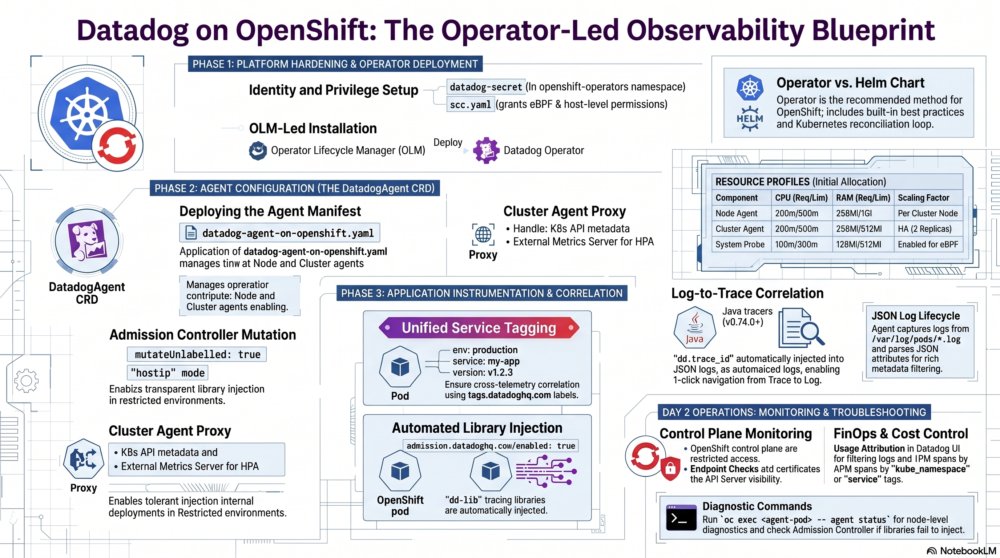
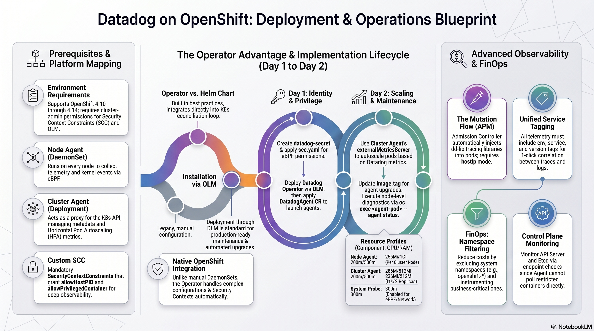
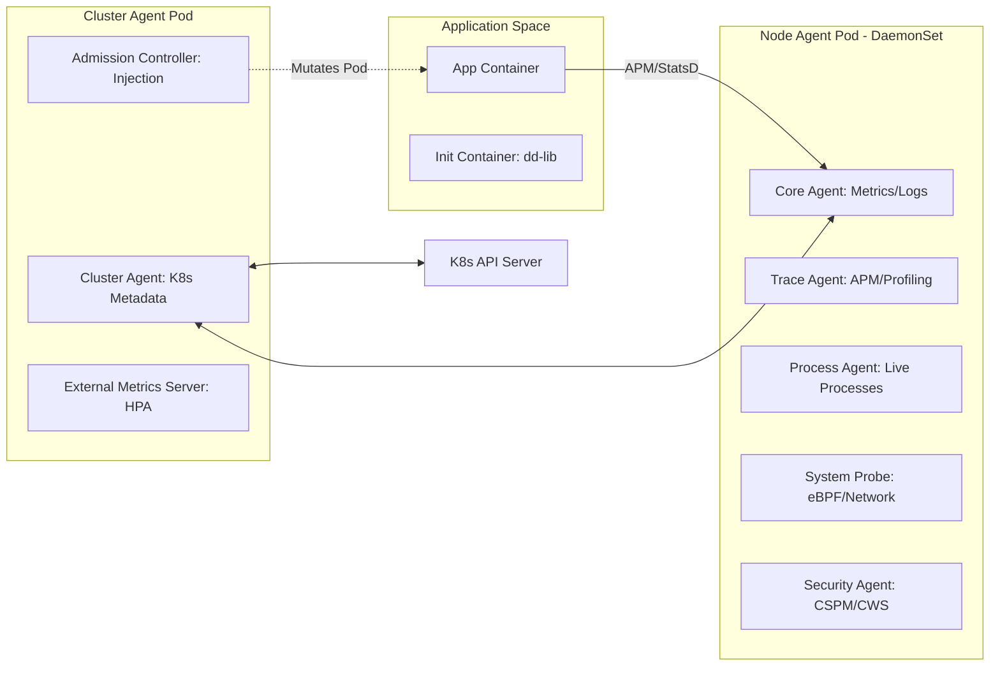
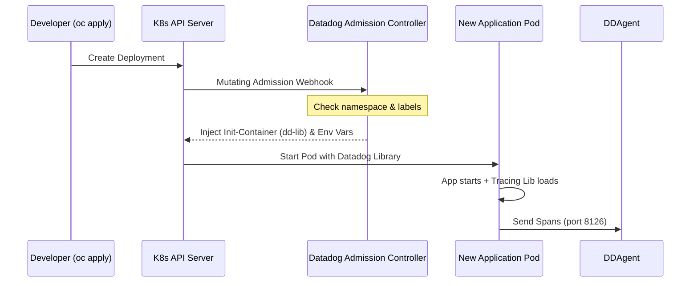

# 🛠️ Master Engineering Documentation: Datadog on OpenShift

> [!IMPORTANT]
> **AI Usage Disclosure**:
> - 💻 **Code**: All code in this repository was generated **without AI assistance**.
> - 📝 **Documentation**: This `README.md` and the English version ([`README-English.md`](README-English.md)) were recently enhanced and generated with **AI assistance** (including tools like NotebookLM).
> - 🇪🇸 **Spanish Documentation**: The original documentation ([`README-Spanish.md`](README-Spanish.md)) was written **manually**.
>
> **Note**: This document (`README.md`) is a full engineering guide that synthesizes the high-level architecture with the detailed technical procedures from all implementation solutions.

---

<details>
<summary>📊 View Architecture and Deployment Infographics (Click to expand)</summary>

### Observability Blueprint


### Platform Deployment Operations Blueprint


</details>

---

## 🤖 AI-Generated Summaries & Multimedia (NotebookLM & YouTube)

This repository includes a comprehensive multi-format educational series synthesized with **Gemini NotebookLM** based directly on this repository's code, manifests, and documentation. All videos and shorts are published and freely accessible on YouTube on the [**@nubenetes**](https://youtube.com/@nubenetes) channel.

> [!NOTE]
> **Multilingual Learning Experience**:
> Content features native spoken audio in **English 🇺🇸** or **Spanish 🇪🇸**, and includes automated YouTube subtitles / closed captions (CC) translated into **20+ languages** (French, German, Japanese, Portuguese, Italian, Arabic, Hindi, etc.) for global knowledge sharing.

### 🎬 Full-Length Technical Deep Dives (Videos & Podcasts)

| # | Format | Video / Podcast Title | Category / Domain | Origin Language | Duration | Direct YouTube Link |
|---|:---:|---|---|:---:|:---:|---|
| 1 | 📽️ Video Guide | [**Datadog on OpenShift (Part 1)**](https://www.youtube.com/watch?v=uE4qFDB4oe4) | Architecture & Core Fundamentals | 🇺🇸 English *(CC 20+)* | `8:00` | [▶️ Watch Video](https://www.youtube.com/watch?v=uE4qFDB4oe4) |
| 2 | 📽️ Video Guide | [**Datadog on OpenShift 2 (Part 2)**](https://www.youtube.com/watch?v=psCcEi61Zmg) | APM & Advanced Instrumentation | 🇺🇸 English *(CC 20+)* | `8:39` | [▶️ Watch Video](https://www.youtube.com/watch?v=psCcEi61Zmg) |
| 3 | 🎙️ **Podcast** | [**Podcast: Evita la bancarrota en Datadog por logs en OpenShift**](https://www.youtube.com/watch?v=EXC-9h8_iP0) | FinOps & Cost Optimization | 🇪🇸 Español *(CC)* | `21:05` | [▶️ Escuchar Podcast](https://www.youtube.com/watch?v=EXC-9h8_iP0) |
| 4 | 🎙️ **Podcast** | [**Podcast: Scaling Datadog on OpenShift with Operators**](https://www.youtube.com/watch?v=gRCZkp8u8eY) | Platform Engineering & Scaling | 🇺🇸 English *(CC 20+)* | `47:43` | [▶️ Listen to Podcast](https://www.youtube.com/watch?v=gRCZkp8u8eY) |
| 5 | 📽️ Video Guide | [**Datadog on OpenShift 3 (Part 3)**](https://www.youtube.com/watch?v=67Fg9wcdwGo) | Metrics, Logs & Day-2 Ops | 🇺🇸 English *(CC 20+)* | `9:10` | [▶️ Watch Video](https://www.youtube.com/watch?v=67Fg9wcdwGo) |
| 6 | 📽️ Video Guide | [**Datadog in GitOps: CI Visibility & Canary Rollouts**](https://www.youtube.com/watch?v=VQKNKBGRxQM) | GitOps & Progressive Delivery | 🇺🇸 English *(CC)* | `7:55` | [▶️ Watch Video](https://www.youtube.com/watch?v=VQKNKBGRxQM) |

### ⚡ Topic-Focused Technical Shorts

| # | Short Title | Category | Origin Language | Duration | Direct YouTube Link |
|---|---|---|:---:|:---:|---|
| 1 | [**Inside the Datadog Operator Architecture**](https://www.youtube.com/shorts/5dY7Cw-fEjc) | Architecture & Operators | 🇺🇸 English *(CC 20+)* | `1:21` | [▶️ Watch Short](https://www.youtube.com/shorts/5dY7Cw-fEjc) |
| 2 | [**Cómo dominar Datadog en OpenShift**](https://www.youtube.com/shorts/L8RF5shI_v4) | Architecture & Operators | 🇪🇸 Español *(CC)* | `1:15` | [▶️ Ver Short](https://www.youtube.com/shorts/L8RF5shI_v4) |
| 3 | [**How Node Level Filtering Cuts Datadog Costs**](https://www.youtube.com/shorts/tkRsD0KrjkI) | FinOps & Cost Control | 🇺🇸 English *(CC 20+)* | `1:17` | [▶️ Watch Short](https://www.youtube.com/shorts/tkRsD0KrjkI) |
| 4 | [**Cómo reducir costes en Datadog**](https://www.youtube.com/shorts/RmZzaj9eT8U) | FinOps & Cost Control | 🇪🇸 Español *(CC)* | `1:05` | [▶️ Ver Short](https://www.youtube.com/shorts/RmZzaj9eT8U) |
| 5 | [**How Datadog Auto Instruments OpenShift Apps**](https://www.youtube.com/shorts/rhqJi-mROqE) | APM & Auto-Instrumentation | 🇺🇸 English *(CC 20+)* | `1:12` | [▶️ Watch Short](https://www.youtube.com/shorts/rhqJi-mROqE) |
| 6 | [**Cómo Datadog inyecta librerías en OpenShift**](https://www.youtube.com/shorts/edros1m5Aoo) | APM & Auto-Instrumentation | 🇪🇸 Español *(CC)* | `1:10` | [▶️ Ver Short](https://www.youtube.com/shorts/edros1m5Aoo) |
| 7 | [**How Datadog Automates Log Correlation**](https://www.youtube.com/shorts/ZhVywUCThv4) | Observability & Correlation | 🇺🇸 English *(CC 20+)* | `1:13` | [▶️ Watch Short](https://www.youtube.com/shorts/ZhVywUCThv4) |
| 8 | [**How Datadog Automates Canary Rollouts**](https://www.youtube.com/shorts/RPtczCFl2vU) | GitOps & Progressive Delivery | 🇺🇸 English | `1:26` | [▶️ Watch Short](https://www.youtube.com/shorts/RPtczCFl2vU) |
| 9 | [**How Linux CFS Throttling Freezes Microservices**](https://www.youtube.com/shorts/XyKAGxQScVo) | Performance & Tuning | 🇺🇸 English | `1:13` | [▶️ Watch Short](https://www.youtube.com/shorts/XyKAGxQScVo) |

*For complete descriptions and the full progressive learning path, see [Section 21: Video Walkthroughs & Architecture References](#21-video-walkthroughs--architecture-references-youtube).*

### 📁 Offline Engineering Artifacts
- 📽️ [**Video Summary (English MP4)**](resources/ai-summaries/Datadog_on_OpenShift_English.mp4): A high-level technical overview of the project.
- 📽️ [**Video Resumen (Español MP4)**](resources/ai-summaries/Datadog_Operator_Spanish.mp4): Resumen técnico sobre el uso del Datadog Operator.
- 📊 [**Technical Presentation (PDF)**](resources/ai-summaries/Datadog_OpenShift_Technical_Blueprint.pdf): Detailed blueprint and architectural overview.
- 📊 [**Technical Presentation (PPTX)**](resources/ai-summaries/Datadog_OpenShift_Technical_Blueprint.pptx): Editable PowerPoint version of the technical blueprint.

---

## 📋 Table of Contents
- [1. Executive Summary](#1-executive-summary)
- [2. Quick Navigation Map](#2-quick-navigation-map)
- [3. Prerequisites and Environment](#3-prerequisites-and-environment)
- [4. Platform Engineering: Object Mapping](#4-platform-engineering-object-mapping)
- [5. Unified Tagging and Discovery Schema](#5-unified-tagging-and-discovery-schema)
- [6. Architectural Design (HLD and LLD)](#6-architectural-design-hld-and-lld)
  - [6.1 High-Level Architecture (Management and Data Flow)](#61-high-level-architecture-management-and-data-flow)
  - [6.2 Low-Level Design: Agent Components](#62-low-level-design-agent-components)
  - [6.3 Component Interaction Sequence](#63-component-interaction-sequence)
- [7. Solution Inventory and Directory Mapping](#7-solution-inventory-and-directory-mapping)
- [8. Deep-Dive: Observability and Correlation](#8-deep-dive-observability-and-correlation)
  - [8.1 Unified Service Tagging](#81-unified-service-tagging)
  - [8.2 APM and Library Injection (The Mutation Flow)](#82-apm-and-library-injection-the-mutation-flow)
  - [8.3 Log Lifecycle and JSON Parsing](#83-log-lifecycle-and-json-parsing)
- [9. Day 1: Installation and Initial Hardening](#9-day-1-installation-and-initial-hardening)
- [10. Day 2: Operations and Maintenance](#10-day-2-operations-and-maintenance)
- [11. Persona-Based Operations](#11-persona-based-operations)
- [12. FinOps: Cost Control and Filtering](#12-finops-cost-control-and-filtering)
- [13. Performance and Resource Profile](#13-performance-and-resource-profile)
- [14. Tracing, Profiling and Instrumentation](#14-tracing-profiling-and-instrumentation)
- [15. Advanced Metrics and Autodiscovery](#15-advanced-metrics-and-autodiscovery)
- [16. Log Management and Correlation](#16-log-management-and-correlation)
- [17. Control Plane and Audit Monitoring](#17-control-plane-and-audit-monitoring)
- [18. Troubleshooting Decision Tree](#18-troubleshooting-decision-tree)
- [19. Technical Reference and Source of Truth](#19-technical-reference-and-source-of-truth)
- [20. Troubleshooting and FAQ](#20-troubleshooting-and-faq)
- [21. Video Walkthroughs & Architecture References (YouTube)](#21-video-walkthroughs--architecture-references-youtube)

---

## 1. Executive Summary
This project implements a multi-tenant, high-availability observability stack using Datadog components. It is tailored for **OpenShift 4.x**, focusing on the transition from simple manual manifests to a modern **Operator-led** lifecycle. The goal is to provide 360-degree visibility while maintaining strict security standards.

---

## 2. Quick Navigation Map
```text
./
├── solution-2-operator/              # ⭐️ Recommended On-Prem Solution
│   ├── datadog-agent-on-openshift.yaml # Main Agent Custom Resource Definition
│   ├── scc.yaml                        # Security Context Constraints for eBPF/Host access
│   └── datadog-operator-olm/           # Operator Lifecycle Manager manifests
├── solution-1-helm-chart/            # Legacy Helm deployment (Simple manifests)
├── apm-poc/                          # Java Spring demo app with APM instrumentation
└── images/                           # Architecture diagrams and UI screenshots
```

---

## 3. Prerequisites and Environment
- **Environment**: OpenShift 4.10+ (Tested up to 4.14).
- **Permissions**: `cluster-admin` required for SCCs and OLM.
- **Credentials**: Datadog API Key and DockerHub Secret for library injection.
- **CLIs**: `oc` (OpenShift CLI) and `helm` (v3+) installed.

---

## 4. Platform Engineering: Object Mapping
Analysis of Infrastructure as Code (IaC) components.

| Component | K8s/OCP Object | Critical Function (Reverse Engineered) |
| :--- | :--- | :--- |
| **Node Agent** | `DaemonSet` | Collects node-level telemetry and kernel events via eBPF. |
| **Cluster Agent** | `Deployment` | Acts as a proxy for K8s API; handles metadata and HPA metrics. |
| **Admission Controller** | `Webhook` | Mutates Pods to inject `dd-lib` tracing libraries automatically. |
| **Custom SCC** | `SecurityContextConstraints` | Grants `allowHostPID` and `allowPrivilegedContainer` for deep observability. |

---

## 5. Unified Tagging and Discovery Schema
Datadog best practices for OpenShift auto-discovery.

| Metadata Type | Required Label | Description |
| :--- | :--- | :--- |
| **Service Name** | `tags.datadoghq.com/service` | Maps to the `service` attribute in Datadog. |
| **Environment** | `tags.datadoghq.com/env` | Maps to `env` (prod, dev, staging). |
| **Version** | `tags.datadoghq.com/version` | Enables version comparison in APM and Logs. |
| **Injection** | `admission.datadoghq.com/enabled` | Triggers the mutation flow for library injection. |

---

## 6. Architectural Design (HLD and LLD)

### 6.1 High-Level Architecture (Management and Data Flow)

<details>
<summary>Click to expand: High-Level Architecture Diagram</summary>


</details>

### 6.2 Low-Level Design: Agent Components

<details>
<summary>Click to expand: Low-Level Design Diagram</summary>



</details>

### 6.3 Component Interaction Sequence
How the Admission Controller instruments a new application.



---

## 7. Solution Inventory and Directory Mapping
| Solution | Directory | Tech Stack | Status |
|----------|-----------|------------|--------|
| **Solution 1** | [`solution-1-helm-chart/`](./solution-1-helm-chart/) | Helm v3, Datadog Agent | Legacy |
| **Solution 2** | [`solution-2-operator/`](./solution-2-operator/) | Datadog Operator, OLM, CRDs | **Recommended** |
| **APM PoC** | [`apm-poc/`](./apm-poc/) | Java Spring, K8s Manifests | Reference |

---

## 8. Deep-Dive: Observability and Correlation

### 8.1 Unified Service Tagging
Every piece of data MUST have:
- `env`: Deployment environment (`prod`, `dev`).
- `service`: Logic name of the app (`order-service`).
- `version`: Git SHA or SEMVER (`v1.2.3`).

### 8.2 APM and Library Injection (The Mutation Flow)
Configured in `solution-2-operator/datadog-agent-on-openshift.yaml`:
- **Mode**: `hostip` (recommended for OpenShift).
- **Automation**: `mutateUnlabelled: true` enables transparent injection.

### 8.3 Log Lifecycle and JSON Parsing
- **Source**: Files in `/var/log/pods/*.log`.
- **Parsing**: The agent automatically detects JSON logs and extracts attributes.
- **Correlation**: For Java, we use the newer tracers that inject `dd.trace_id` directly into the log's JSON object, enabling 1-click navigation from a Trace to its corresponding Logs.

---

## 9. Day 1: Installation and Initial Hardening
1.  **Identity**: Create `datadog-secret` in `openshift-operators`.
2.  **Privilege**: Apply [`scc.yaml`](./solution-2-operator/scc.yaml). This grants the agent permissions to read `/proc` and use eBPF.
3.  **Operator**: Deploy via OLM in the [`datadog-operator-olm`](./solution-2-operator/datadog-operator-olm/) folder.
4.  **Agent**: Apply [`datadog-agent-on-openshift.yaml`](./solution-2-operator/datadog-agent-on-openshift.yaml).

---

## 10. Day 2: Operations and Maintenance
- **Scaling**: The Cluster Agent handles high-load via `externalMetricsServer` to autoscale pods based on Datadog metrics (HPA).
- **Upgrades**: OLM automatically manages Operator upgrades. Agent upgrades are performed by updating the `image.tag` in the `DatadogAgent` CR.
- **Troubleshooting**: Use `oc exec <agent-pod> -- agent status` for node-level diagnostics.

---

## 11. Persona-Based Operations

### 11.1 Cluster Administrator (OCP Admin)
- **Role**: Infrastructure health and security.
- **Tasks**: Manage SCCs, monitor Node/Control Plane health, ensure the Agent isn't consuming too many resources (QoS).

### 11.2 SRE / Observability Engineer
- **Role**: Data quality and Cost control.
- **Tasks**: Define tagging standards, configure Log Pipelines in Datadog SaaS, monitor "Ingested vs Indexed" log volume.

### 11.3 Application Developer
- **Role**: Application performance.
- **Tasks**: Add `tags.datadoghq.com` labels to deployments, use the Datadog UI to analyze flame graphs and bottlenecks.

---

## 12. FinOps: Cost Control and Filtering
We filter at the **OpenShift Worker Node** level to prevent junk data from reaching the cloud billing.
- **Inclusion**: Only instrument specific business namespaces.
- **Exclusion**: Always exclude system namespaces (`kube-system`, `openshift-*`).

```yaml
containerInclude: "kube_namespace:^app-.*$"
containerExclude: "kube_namespace:.*"
```

### 📈 Verifying Usage
To monitor costs, use the **Usage Attribution** page in the Datadog UI. You can filter by the `kube_namespace` or `service` tags to see the breakdown of:
- Indexed Log Volume.
- APM Span Counts.
- Infrastructure Host counts.

---

## 13. Performance and Resource Profile
| Component | CPU (Req/Lim) | RAM (Req/Lim) | Scaling Factor |
| :--- | :--- | :--- | :--- |
| **Node Agent** | 200m / 500m | 256Mi / 1Gi | Per Cluster Node |
| **Cluster Agent** | 200m / 500m | 256Mi / 512Mi | High Availability (2 Replicas) |
| **System Probe** | 100m / 300m | 128Mi / 512Mi | Enabled for eBPF/Network |

- **Resource Limits**: Monitor usage baseline via `oc top` or Datadog's `container.memory.usage`.
- **HPA Integration**: Use the Cluster Agent's `externalMetricsServer` to autoscale pods based on Datadog metrics.

---

## 14. Tracing, Profiling and Instrumentation
- **Debugging vs. Tracing vs. Profiling**: Tracing captures chronological events (flow analysis), profiling aggregates execution data (e.g., CPU/memory bottlenecks over time).
- **Java Configuration**: Recommended mechanism involves configuring `dd.service.mapping` and splitting DB metrics:
  ```yaml
  env:
    - name: DD_PROFILING_ENABLED
      value: 'true'
  ```
- **Library Injection Mode**: For OpenShift, use `hostip`:
  ```yaml
  labels:
    admission.datadoghq.com/enabled: "true"
    admission.datadoghq.com/config.mode: "hostip"
  annotations:
    admission.datadoghq.com/java-lib.version: "latest"
  ```

---

## 15. Advanced Metrics and Autodiscovery
- **JMX Autodiscovery**: Set annotations on the POD for automatic configuration:
  ```yaml
  annotations:
    ad.datadoghq.com/<CONTAINER_IDENTIFIER>.checks: |
      {
        "<INTEGRATION_NAME>": {
          "init_config": {"is_jmx": true, "collect_default_metrics": true},
          "instances": [{"host": "%%host%%", "port": "<JMX_PORT>"}]
        }
      }
  ```
- **Custom Prometheus Metrics**: Enable `prometheusScrape` in the Operator's CRD:
  ```yaml
  prometheusScrape:
    enabled: true
    enableServiceEndpoints: true
    additionalConfigs: |-
      - autodiscovery:
        kubernetes_annotations:
          include:
            app: my-app
  ```
  And annotate the Pod:
  ```yaml
  annotations: 
    prometheus.io/scrape: "true"
    prometheus.io/port: "metrics-port"
  ```

---

## 16. Log Management and Correlation
- **JSON Log Formatting**: Use `logstash-logback-encoder` in Java for native correlation.
- **Correlation**: Newer Java tracers (>= 0.74.0) inject IDs automatically into JSON logs.
- **Multi-line Rules**: Configure via annotations:
  ```yaml
  annotations:
    ad.datadoghq.com/<CONTAINER_IDENTIFIER>.logs: '[{"source": "java", "service": "<service>", "log_processing_rules": [{"type": "multi_line", "name": "log_start_with_date", "pattern" : "\\d{4}-(0?[1-9]|1[012])-(0?[1-9]|[12][0-9]|3[01])"}]}]'
  ```

---

## 17. Control Plane and Audit Monitoring
OpenShift 4 requires endpoint checks to monitor core components:
- **API Server**: 
  ```bash
  oc annotate service kubernetes -n default 'ad.datadoghq.com/endpoints.check_names=["kube_apiserver_metrics"]'
  oc annotate service kubernetes -n default 'ad.datadoghq.com/endpoints.instances=[{"prometheus_url": "https://%%host%%:%%port%%/metrics", "bearer_token_auth": "true"}]'
  ```
- **Etcd Certificates**: Copy and mount them in Cluster Check Runners:
  ```bash
  oc get secret kube-etcd-client-certs -n openshift-monitoring -o yaml | sed 's/namespace: openshift-monitoring/namespace: openshift-operators/' | oc create -f -
  ```
- **Audit Logs**: Set `features.logCollection.containerCollectAll: true` in your DatadogAgent to capture Kubernetes audit events.

---

## 18. Troubleshooting Decision Tree

<details>
<summary>Click to expand: Troubleshooting Decision Tree Diagram</summary>


</details>

---

## 19. Technical Reference and Source of Truth
- **Main Config**: [`solution-2-operator/datadog-agent-on-openshift.yaml`](./solution-2-operator/datadog-agent-on-openshift.yaml)
- **Security Policy**: [`solution-2-operator/scc.yaml`](./solution-2-operator/scc.yaml)
- **Demo App**: [`apm-poc/k8s/depl-with-lib-inj.yaml`](./apm-poc/k8s/depl-with-lib-inj.yaml)

### 🛠️ Useful Tools & API
- **Dogshell CLI**:
  ```bash
  pip install datadog
  dog metric post test_metric 1
  ```
- **curl API**:
  ```bash
  curl -X GET "https://api.datadoghq.eu/api/v2/container_images" \
  -H "DD-API-KEY: ${DD_API_KEY}" \
  -H "DD-APPLICATION-KEY: ${DD_APP_KEY}"
  ```

---

## 20. Troubleshooting and FAQ

### ❓ Why are API Server logs/CPU metrics missing in OCP 4.x?
**Expert Insight**: On OpenShift 4, control plane components (API Server, Controller Manager) must be monitored via **endpoint checks** because the Agent cannot poll the running containers directly for certain metrics. This endpoint architectural constraint means container-level metrics (like `kubernetes.cpu.requests`) and logs from these images are often unavailable in standard dashboards.

### ❓ How do I handle Agent resource usage?
**Expert Insight**: Observability overhead is highly dependent on enabled features. Datadog recommends watching `container.cpu.usage` and `container.memory.usage` over a week to establish a baseline, then setting limits at approximately 2x the baseline to handle bursts.

### ❓ APM libraries are not being injected?
Check the `admission.datadoghq.com/config.mode` label. For OpenShift, it **must** be `hostip` due to the restricted SCC environment.

---

## 21. Video Walkthroughs & Architecture References (YouTube)

Architectural deep dives, video walkthroughs, and technical shorts for Datadog on OpenShift 4.x, full-stack observability, and automated canary progressive delivery are hosted on the **[Nubenetes YouTube Channel (@nubenetes)](https://www.youtube.com/@nubenetes)**.

> [!NOTE]
> **Multilingual Learning Experience**:
> All videos and shorts were synthesized using **Gemini NotebookLM** taking this repository ([`datadog-agent-openshift`](https://github.com/nubenetes/datadog-agent-openshift)) as technical ground truth. Content is delivered in native **English 🇺🇸** or **Spanish 🇪🇸**, and features YouTube closed captions (CC) automatically translated into **20+ languages** (French, German, Japanese, Portuguese, Italian, Arabic, Hindi, etc.) for worldwide knowledge sharing.

### 🗺️ Recommended Learning Path

To get the most out of this repository, we recommend following this learning sequence:
1. **Foundations & Architecture**: Start with *Datadog on OpenShift (Part 1)* and *Inside the Datadog Operator Architecture* to understand OCP 4.x prerequisites, SCCs, and DaemonSets.
2. **APM & Auto-Instrumentation**: Watch *Datadog on OpenShift (Part 2)* and *How Datadog Auto Instruments OpenShift Apps* to learn zero-code tracing via the Admission Controller.
3. **Metrics, Logging & Day-2 Operations**: Watch *Datadog on OpenShift 3 (Part 3)* and *How Datadog Automates Log Correlation* for control plane monitoring, JMX autodiscovery, and kube-state-metrics.
4. **FinOps & Cost Control**: Watch *Evita la bancarrota por logs en OpenShift* and *How Node Level Filtering Cuts Datadog Costs* to protect your budget by filtering noisy system logs in origin.
5. **Platform Engineering at Scale**: Complete the masterclass *Scaling Datadog on OpenShift with Operators* for production-grade Day-2 operations, CRD reconciliation, and OLM management.

---

### 🎬 Full-Length Technical Deep Dives & Masterclasses (Videos & Podcasts)

| # | Format | Video / Podcast Title | Category / Domain | Origin Language | Duration | Direct Link |
|---|:---:|---|---|:---:|:---:|---|
| 1 | 📽️ Video Guide | [**Datadog on OpenShift (Part 1)**](https://www.youtube.com/watch?v=uE4qFDB4oe4) | Architecture & Core Fundamentals | 🇺🇸 English *(CC 20+)* | `8:00` | [▶️ Watch Video](https://www.youtube.com/watch?v=uE4qFDB4oe4) |
| 2 | 📽️ Video Guide | [**Datadog on OpenShift 2 (Part 2)**](https://www.youtube.com/watch?v=psCcEi61Zmg) | APM & Advanced Instrumentation | 🇺🇸 English *(CC 20+)* | `8:39` | [▶️ Watch Video](https://www.youtube.com/watch?v=psCcEi61Zmg) |
| 3 | 🎙️ **Podcast** | [**Podcast: Evita la bancarrota en Datadog por logs en OpenShift**](https://www.youtube.com/watch?v=EXC-9h8_iP0) | FinOps & Cost Control | 🇪🇸 Español *(CC)* | `21:05` | [▶️ Escuchar Podcast](https://www.youtube.com/watch?v=EXC-9h8_iP0) |
| 4 | 🎙️ **Podcast** | [**Podcast: Scaling Datadog on OpenShift with Operators**](https://www.youtube.com/watch?v=gRCZkp8u8eY) | Platform Engineering & Scaling | 🇺🇸 English *(CC 20+)* | `47:43` | [▶️ Listen to Podcast](https://www.youtube.com/watch?v=gRCZkp8u8eY) |
| 5 | 📽️ Video Guide | [**Datadog on OpenShift 3 (Part 3)**](https://www.youtube.com/watch?v=67Fg9wcdwGo) | Metrics, Logs & Day-2 Ops | 🇺🇸 English *(CC 20+)* | `9:10` | [▶️ Watch Video](https://www.youtube.com/watch?v=67Fg9wcdwGo) |
| 6 | 📽️ Video Guide | [**Datadog in GitOps: CI Visibility & Canary Rollouts**](https://www.youtube.com/watch?v=VQKNKBGRxQM) | GitOps & Progressive Delivery | 🇺🇸 English *(CC)* | `7:55` | [▶️ Watch Video](https://www.youtube.com/watch?v=VQKNKBGRxQM) |

<details open>
<summary>🔍 <strong>Detailed Breakdown: Full-Length Sessions & Podcasts</strong></summary>

<br/>

##### 1. Datadog on OpenShift (Part 1)
- 🔗 **Link**: [https://www.youtube.com/watch?v=uE4qFDB4oe4](https://www.youtube.com/watch?v=uE4qFDB4oe4)
- 🎙️ **Format**: 📽️ Technical Video Guide
- 🏷️ **Category**: Architecture & Core Fundamentals
- 🌐 **Origin Language**: English (Subtitles in 20+ languages)
- ⏱️ **Duration**: 8:00
- 📝 **Description**: High-level technical overview of deploying and operating Datadog on Red Hat OpenShift (OCP 4.x). Explores the Node Agent DaemonSet, Cluster Agent, Security Context Constraints (SCC) required for host access and eBPF, and Unified Service Tagging across metrics and logs.

##### 2. Datadog on OpenShift 2 (Part 2)
- 🔗 **Link**: [https://www.youtube.com/watch?v=psCcEi61Zmg](https://www.youtube.com/watch?v=psCcEi61Zmg)
- 🎙️ **Format**: 📽️ Technical Video Guide
- 🏷️ **Category**: APM & Advanced Instrumentation
- 🌐 **Origin Language**: English (Subtitles in 20+ languages)
- ⏱️ **Duration**: 8:39
- 📝 **Description**: Deep dive into Application Performance Monitoring (APM) on OpenShift. Covers single-step auto-instrumentation via the Datadog Admission Controller (in `hostip` mode), distributed trace correlation with container logs, live process inspection, and troubleshooting common instrumentation pitfalls.

##### 3. Podcast: Evita la bancarrota en Datadog por logs en OpenShift
- 🔗 **Link**: [https://www.youtube.com/watch?v=EXC-9h8_iP0](https://www.youtube.com/watch?v=EXC-9h8_iP0)
- 🎙️ **Format**: 🎙️ Deep Dive Podcast (Conversación dinámica NotebookLM)
- 🏷️ **Category**: FinOps & Cost Control
- 🌐 **Origin Language**: Español (Subtítulos multilingües)
- ⏱️ **Duration**: 21:05
- 📝 **Description**: Episodio en formato podcast analizando exhaustivamente FinOps para evitar facturas descontroladas en Datadog por el volumen masivo de logs en OpenShift. Aprende a aplicar filtrado en origen en Worker Nodes (`containerExclude`), excluir namespaces ruidosos (`openshift-*`, `kube-system`), entender la diferencia entre Ingested e Indexed logs, y usar Observability Pipelines para recortar costes antes de la nube.

##### 4. Podcast: Scaling Datadog on OpenShift with Operators
- 🔗 **Link**: [https://www.youtube.com/watch?v=gRCZkp8u8eY](https://www.youtube.com/watch?v=gRCZkp8u8eY)
- 🎙️ **Format**: 🎙️ Deep Dive Podcast (Conversational NotebookLM Masterclass)
- 🏷️ **Category**: Platform Engineering & Scaling
- 🌐 **Origin Language**: English (Subtitles/CC in 20+ languages)
- ⏱️ **Duration**: 47:43
- 📝 **Description**: Full podcast masterclass on deploying and scaling Datadog across enterprise OpenShift clusters. Compares Helm vs. Operator approaches, demonstrates installation via Operator Lifecycle Manager (OLM), breaks down the `DatadogAgent` CRD (`v2alpha1`) reconciliation loop, and details autoscaling with the Datadog Cluster Agent and External Metrics Provider.

##### 5. Datadog on OpenShift 3 (Part 3)
- 🔗 **Link**: [https://www.youtube.com/watch?v=67Fg9wcdwGo](https://www.youtube.com/watch?v=67Fg9wcdwGo)
- 🎙️ **Format**: 📽️ Technical Video Guide
- 🏷️ **Category**: Metrics, Logs & Day-2 Operations
- 🌐 **Origin Language**: English (Subtitles/CC in 20+ languages)
- ⏱️ **Duration**: 9:10
- 📝 **Description**: Advanced Day-2 platform observability guide. Covers container log autodiscovery and multiline log processing, Kubernetes control plane telemetry (API Server, Controller Manager, Scheduler) with secure ports and certificates, JMX metrics extraction, and kube-state-metrics integration.

##### 6. Datadog in GitOps: CI Visibility & Canary Rollouts
- 🔗 **Link**: [https://www.youtube.com/watch?v=VQKNKBGRxQM](https://www.youtube.com/watch?v=VQKNKBGRxQM)
- 🎙️ **Format**: 📽️ Technical Video Guide
- 🏷️ **Category**: GitOps & Progressive Delivery
- 🌐 **Origin Language**: English
- ⏱️ **Duration**: 7:55
- 📝 **Description**: Using Datadog as the central nervous system for multi-cluster GitOps platforms on OpenShift. Covers Jenkins CI Visibility plugin for build trace correlation, runtime Java APM tracing, and metric-driven progressive delivery with automated canary rollbacks via Argo Rollouts.

</details>

---

### ⚡ Technical Shorts (Categorized by Domain)

Quick, high-impact technical takeaways organized by domain for rapid knowledge acquisition:

| # | Short Title | Category | Origin Language | Duration | Direct Link |
|---|---|---|:---:|:---:|---|
| 1 | [Inside the Datadog Operator Architecture](https://www.youtube.com/shorts/5dY7Cw-fEjc) | Architecture & Operators | 🇺🇸 English *(CC 20+)* | `1:21` | [▶️ Watch](https://www.youtube.com/shorts/5dY7Cw-fEjc) |
| 2 | [Cómo dominar Datadog en OpenShift](https://www.youtube.com/shorts/L8RF5shI_v4) | Architecture & Operators | 🇪🇸 Español *(CC)* | `1:15` | [▶️ Watch](https://www.youtube.com/shorts/L8RF5shI_v4) |
| 3 | [How Node Level Filtering Cuts Datadog Costs](https://www.youtube.com/shorts/tkRsD0KrjkI) | FinOps & Cost Control | 🇺🇸 English *(CC 20+)* | `1:17` | [▶️ Watch](https://www.youtube.com/shorts/tkRsD0KrjkI) |
| 4 | [Cómo reducir costes en Datadog](https://www.youtube.com/shorts/RmZzaj9eT8U) | FinOps & Cost Control | 🇪🇸 Español *(CC)* | `1:05` | [▶️ Watch](https://www.youtube.com/shorts/RmZzaj9eT8U) |
| 5 | [How Datadog Auto Instruments OpenShift Apps](https://www.youtube.com/shorts/rhqJi-mROqE) | APM & Auto-Instrumentation | 🇺🇸 English *(CC 20+)* | `1:12` | [▶️ Watch](https://www.youtube.com/shorts/rhqJi-mROqE) |
| 6 | [Cómo Datadog inyecta librerías en OpenShift](https://www.youtube.com/shorts/edros1m5Aoo) | APM & Auto-Instrumentation | 🇪🇸 Español *(CC)* | `1:10` | [▶️ Watch](https://www.youtube.com/shorts/edros1m5Aoo) |
| 7 | [How Datadog Automates Log Correlation](https://www.youtube.com/shorts/ZhVywUCThv4) | Observability & Correlation | 🇺🇸 English *(CC 20+)* | `1:13` | [▶️ Watch](https://www.youtube.com/shorts/ZhVywUCThv4) |
| 8 | [How Datadog Automates Canary Rollouts](https://www.youtube.com/shorts/RPtczCFl2vU) | GitOps & Reliability | 🇺🇸 English | `1:26` | [▶️ Watch](https://www.youtube.com/shorts/RPtczCFl2vU) |
| 9 | [How Linux CFS Throttling Freezes Microservices](https://www.youtube.com/shorts/XyKAGxQScVo) | Performance & Tuning | 🇺🇸 English | `1:13` | [▶️ Watch](https://www.youtube.com/shorts/XyKAGxQScVo) |

<details open>
<summary>🔍 <strong>Detailed Breakdown: Technical Shorts by Category</strong></summary>

<br/>

#### 🏛️ Category 1: Architecture & Operators
- 🇺🇸 [**Inside the Datadog Operator Architecture**](https://www.youtube.com/shorts/5dY7Cw-fEjc) `(1:21)`  
  *Origin Language: English (Subtitles in 20+ languages)*  
  Deconstructs how the Datadog Operator reconciles the `DatadogAgent` CRD, provisions the Node Agent DaemonSet, and manages Cluster Agent communications under OpenShift's security model.
- 🇪🇸 [**Cómo dominar Datadog en OpenShift**](https://www.youtube.com/shorts/L8RF5shI_v4) `(1:15)`  
  *Idioma de Origen: Español (Subtítulos multilingües)*  
  Las 3 claves de ingeniería imprescindibles para triunfar: elección de Operator frente a Helm, Security Context Constraints (SCC) para habilitar eBPF/sockets y gobierno de etiquetas unificadas.

#### 💰 Category 2: FinOps & Cost Optimization
- 🇺🇸 [**How Node Level Filtering Cuts Datadog Costs**](https://www.youtube.com/shorts/tkRsD0KrjkI) `(1:17)`  
  *Origin Language: English (Subtitles in 20+ languages)*  
  Explains how node-level log filtering via `containerExclude` prevents noisy platform and sidecar containers from being shipped to Datadog, cutting ingestion costs before egress.
- 🇪🇸 [**Cómo reducir costes en Datadog**](https://www.youtube.com/shorts/RmZzaj9eT8U) `(1:05)`  
  *Idioma de Origen: Español (Subtítulos multilingües)*  
  FinOps práctico en OpenShift: cómo configurar el Datadog Agent para omitir namespaces de sistema y evitar sorpresas desagradables en la factura mensual de observabilidad.

#### 🔍 Category 3: APM, Tracing & Log Correlation
- 🇺🇸 [**How Datadog Auto Instruments OpenShift Apps**](https://www.youtube.com/shorts/rhqJi-mROqE) `(1:12)`  
  *Origin Language: English (Subtitles in 20+ languages)*  
  How the Datadog Admission Controller intercepts pod creation and transparently injects tracing libraries (Java, Python, Node.js) with zero code modifications.
- 🇪🇸 [**Cómo Datadog inyecta librerías en OpenShift**](https://www.youtube.com/shorts/edros1m5Aoo) `(1:10)`  
  *Idioma de Origen: Español (Subtítulos multilingües)*  
  Cómo opera el mutating webhook del Admission Controller para añadir instrumentación APM a los Pods sin necesidad de editar Dockerfiles ni pipelines de CI/CD.
- 🇺🇸 [**How Datadog Automates Log Correlation**](https://www.youtube.com/shorts/ZhVywUCThv4) `(1:13)`  
  *Origin Language: English (Subtitles in 20+ languages)*  
  How Unified Service Tagging (`env`, `service`, `version`) automatically attaches trace and span IDs to container logs, enabling one-click navigation between logs and APM flame graphs.

#### 🚀 Category 4: Continuous Delivery & Performance
- 🇺🇸 [**How Datadog Automates Canary Rollouts**](https://www.youtube.com/shorts/RPtczCFl2vU) `(1:26)`  
  *Origin Language: English*  
  How Argo Rollouts and Datadog APM metrics automate canary validation with automatic rollbacks if error rates exceed 0.1% or P99 latency spikes.
- 🇺🇸 [**How Linux CFS Throttling Freezes Microservices**](https://www.youtube.com/shorts/XyKAGxQScVo) `(1:13)`  
  *Origin Language: English*  
  Why CPU limits on Kubernetes/OpenShift cause kernel-level Completely Fair Scheduler (CFS) throttling and latency spikes despite idle host CPU.

</details>

