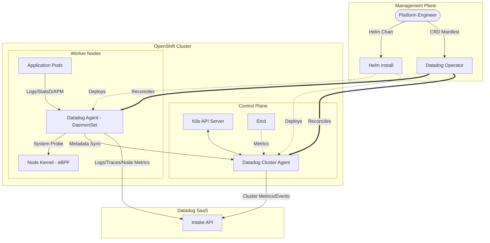
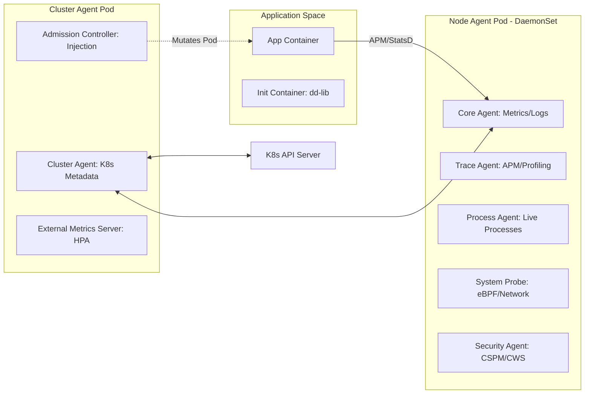
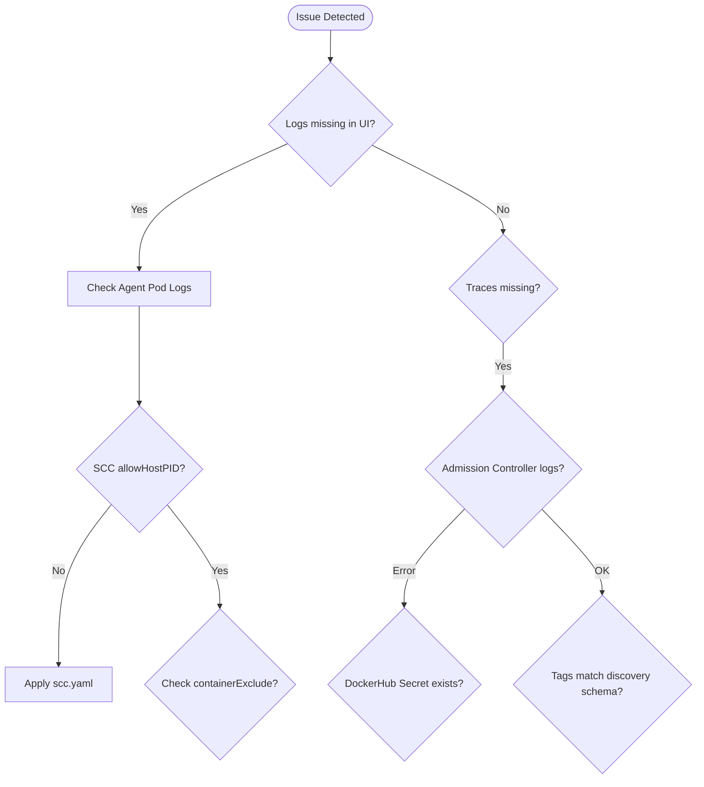

# 🛠️ Master Engineering Documentation: Datadog on OpenShift

> [!IMPORTANT]
> **Spanish Version / Versión en Español**:
> Este repositorio cuenta con una versión original en español redactada manualmente sin el uso de IA: [README-Spanish.md](README-Spanish.md).
>
> **English Version (Full Translation)**:
> A complete English translation of the original manual Spanish documentation is available here: [README-English.md](README-English.md).
>
> **English Version (Engineering Guide and Deep Dive)**:
> This current document (`README.md`) is a full engineering guide that synthesizes the high-level architecture with the detailed technical procedures from all implementation solutions.

---

## 🤖 AI-Generated Summaries (NotebookLM)
Get a quick overview of this repository through AI-generated content:
- 📽️ [**Video Summary (English)**](resources/ai-summaries/Datadog_on_OpenShift_English.mp4): A high-level technical overview of the project.
- 📽️ [**Video Resumen (Español)**](resources/ai-summaries/Datadog_Operator_Spanish.mp4): Resumen técnico sobre el uso del Datadog Operator.
- 📊 [**Technical Presentation (PDF)**](resources/ai-summaries/Datadog_OpenShift_Technical_Blueprint.pdf): Detailed blueprint and architectural overview.
- 📊 [**Technical Presentation (PPTX)**](resources/ai-summaries/Datadog_OpenShift_Technical_Blueprint.pptx): Editable PowerPoint version of the technical blueprint.

---

## 📋 Table of Contents
- [1. Executive Summary](#1-executive-summary)
- [2. Quick Navigation Map](#2-quick-navigation-map)
- [3. Prerequisites and Environment](#3-prerequisites-and-environment)
- [4. Platform Engineering: Object Mapping](#4-platform-engineering-object-mapping)
- [5. Unified Tagging and Discovery Schema](#5-unified-tagging-and-discovery-schema)
- [6. Architectural Design (HLD and LLD)](#6-architectural-design-hld-and-lld)
  - [6.1 High-Level Architecture (Management and Data Flow)](#61-high-level-architecture-management-and-data-flow)
  - [6.2 Low-Level Design: Agent Components](#62-low-level-design-agent-components)
  - [6.3 Component Interaction Sequence](#63-component-interaction-sequence)
- [7. Solution Inventory and Directory Mapping](#7-solution-inventory-and-directory-mapping)
- [8. Deep-Dive: Observability and Correlation](#8-deep-dive-observability-and-correlation)
  - [8.1 Unified Service Tagging](#81-unified-service-tagging)
  - [8.2 APM and Library Injection (The Mutation Flow)](#82-apm-and-library-injection-the-mutation-flow)
  - [8.3 Log Lifecycle and JSON Parsing](#83-log-lifecycle-and-json-parsing)
- [9. Day 1: Installation and Initial Hardening](#9-day-1-installation-and-initial-hardening)
- [10. Day 2: Operations and Maintenance](#10-day-2-operations-and-maintenance)
- [11. Persona-Based Operations](#11-persona-based-operations)
- [12. FinOps: Cost Control and Filtering](#12-finops-cost-control-and-filtering)
- [13. Performance and Resource Profile](#13-performance-and-resource-profile)
- [14. Tracing, Profiling and Instrumentation](#14-tracing-profiling-and-instrumentation)
- [15. Advanced Metrics and Autodiscovery](#15-advanced-metrics-and-autodiscovery)
- [16. Log Management and Correlation](#16-log-management-and-correlation)
- [17. Control Plane and Audit Monitoring](#17-control-plane-and-audit-monitoring)
- [18. Troubleshooting Decision Tree](#18-troubleshooting-decision-tree)
- [19. Technical Reference and Source of Truth](#19-technical-reference-and-source-of-truth)
- [20. Troubleshooting and FAQ](#20-troubleshooting-and-faq)

---

## 1. Executive Summary
This project implements a multi-tenant, high-availability observability stack using Datadog components. It is tailored for **OpenShift 4.x**, focusing on the transition from simple manual manifests to a modern **Operator-led** lifecycle. The goal is to provide 360-degree visibility while maintaining strict security standards.

---

## 2. Quick Navigation Map
```text
./
├── solution-2-operator/              # ⭐️ Recommended On-Prem Solution
│   ├── datadog-agent-on-openshift.yaml # Main Agent Custom Resource Definition
│   ├── scc.yaml                        # Security Context Constraints for eBPF/Host access
│   └── datadog-operator-olm/           # Operator Lifecycle Manager manifests
├── solution-1-helm-chart/            # Legacy Helm deployment (Simple manifests)
├── apm-poc/                          # Java Spring demo app with APM instrumentation
└── images/                           # Architecture diagrams and UI screenshots
```

---

## 3. Prerequisites and Environment
- **Environment**: OpenShift 4.10+ (Tested up to 4.14).
- **Permissions**: `cluster-admin` required for SCCs and OLM.
- **Credentials**: Datadog API Key and DockerHub Secret for library injection.

---

## 4. Platform Engineering: Object Mapping
Analysis of Infrastructure as Code (IaC) components.

| Component | K8s/OCP Object | Critical Function (Reverse Engineered) |
| :--- | :--- | :--- |
| **Node Agent** | `DaemonSet` | Collects node-level telemetry and kernel events via eBPF. |
| **Cluster Agent** | `Deployment` | Acts as a proxy for K8s API; handles metadata and HPA metrics. |
| **Admission Controller** | `Webhook` | Mutates Pods to inject `dd-lib` tracing libraries automatically. |
| **Custom SCC** | `SecurityContextConstraints` | Grants `allowHostPID` and `allowPrivilegedContainer` for deep observability. |

---

## 5. Unified Tagging and Discovery Schema
Datadog best practices for OpenShift auto-discovery.

| Metadata Type | Required Label | Description |
| :--- | :--- | :--- |
| **Service Name** | `tags.datadoghq.com/service` | Maps to the `service` attribute in Datadog. |
| **Environment** | `tags.datadoghq.com/env` | Maps to `env` (prod, dev, staging). |
| **Version** | `tags.datadoghq.com/version` | Enables version comparison in APM and Logs. |
| **Injection** | `admission.datadoghq.com/enabled` | Triggers the mutation flow for library injection. |

---

## 6. Architectural Design (HLD and LLD)

### 6.1 High-Level Architecture (Management and Data Flow)

<details>
<summary>Click to expand: High-Level Architecture Diagram</summary>



</details>

### 6.2 Low-Level Design: Agent Components

<details>
<summary>Click to expand: Low-Level Design Diagram</summary>



</details>

---

## 7. Solution Inventory and Directory Mapping
| Solution | Directory | Tech Stack | Status |
|----------|-----------|------------|--------|
| **Solution 1** | [`solution-1-helm-chart/`](./solution-1-helm-chart/) | Helm v3, Datadog Agent | Legacy |
| **Solution 2** | [`solution-2-operator/`](./solution-2-operator/) | Datadog Operator, OLM, CRDs | **Recommended** |
| **APM PoC** | [`apm-poc/`](./apm-poc/) | Java Spring, K8s Manifests | Reference |

---

## 8. Deep-Dive: Observability and Correlation

### 8.1 Unified Service Tagging
Every piece of data MUST have:
- `env`: Deployment environment (`prod`, `dev`).
- `service`: Logic name of the app (`order-service`).
- `version`: Git SHA or SEMVER (`v1.2.3`).

### 8.2 APM and Library Injection (The Mutation Flow)
Configured in `solution-2-operator/datadog-agent-on-openshift.yaml`:
- **Mode**: `hostip` (recommended for OpenShift).
- **Automation**: `mutateUnlabelled: true` enables transparent injection.

---

## 12. FinOps: Cost Control and Filtering
```yaml
containerInclude: "kube_namespace:^app-.*$"
containerExclude: "kube_namespace:.*"
```

---

## 13. Performance and Resource Profile
| Component | CPU (Req/Lim) | RAM (Req/Lim) | Scaling Factor |
| :--- | :--- | :--- | :--- |
| **Node Agent** | 200m / 500m | 256Mi / 1Gi | Per Cluster Node |
| **Cluster Agent** | 200m / 500m | 256Mi / 512Mi | High Availability (2 Replicas) |
| **System Probe** | 100m / 300m | 128Mi / 512Mi | Enabled for eBPF/Network |

---

## 14. Tracing, Profiling and Instrumentation
- **Java Configuration**:
  ```yaml
  env:
    - name: DD_PROFILING_ENABLED
      value: 'true'
  ```
- **Library Injection Mode**: For OpenShift, use `hostip`.

---

## 15. Advanced Metrics and Autodiscovery
- **JMX Autodiscovery**: Set annotations on the POD:
  ```yaml
  annotations:
    ad.datadoghq.com/<CONTAINER_IDENTIFIER>.checks: |
      {
        "<INTEGRATION_NAME>": {
          "init_config": {"is_jmx": true, "collect_default_metrics": true},
          "instances": [{"host": "%%host%%", "port": "<JMX_PORT>"}]
        }
      }
  ```

---

## 17. Control Plane and Audit Monitoring
- **API Server**: 
  ```bash
  oc annotate service kubernetes -n default 'ad.datadoghq.com/endpoints.check_names=["kube_apiserver_metrics"]'
  ```

---

## 18. Troubleshooting Decision Tree

<details>
<summary>Click to expand: Troubleshooting Decision Tree Diagram</summary>



</details>

---

## 19. Technical Reference and Source of Truth
- **Main Config**: [`solution-2-operator/datadog-agent-on-openshift.yaml`](./solution-2-operator/datadog-agent-on-openshift.yaml)
- **Security Policy**: [`solution-2-operator/scc.yaml`](./solution-2-operator/scc.yaml)

---

## 20. Troubleshooting and FAQ
Refer to Section 19 for Expert Insights on API Server logs and Agent resource usage.
