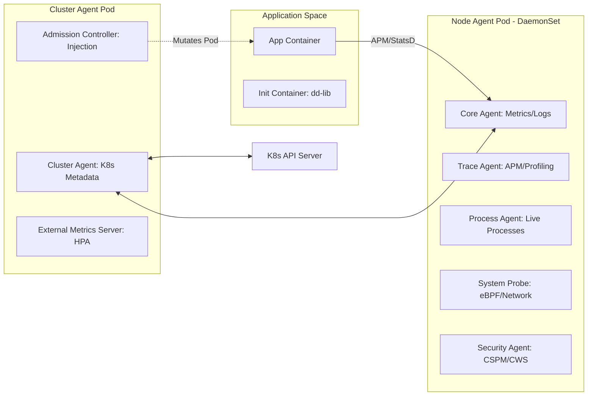
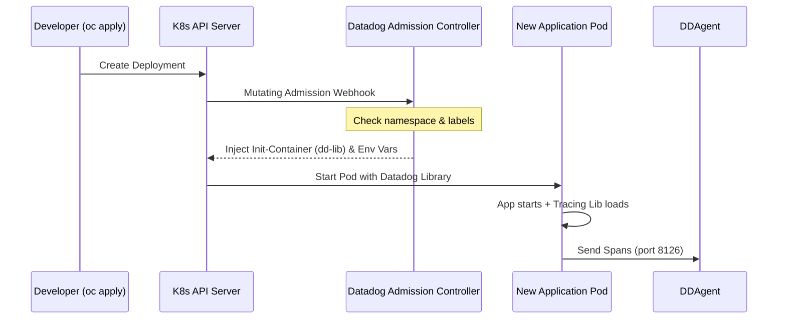

# 🛠️ Master Engineering Documentation: Datadog on OpenShift

> [!IMPORTANT]
> **AI Usage Disclosure**:
> - 💻 **Code**: All code in this repository was generated **without AI assistance**.
> - 📝 **Documentation**: This `README.md` and the English version ([`README-English.md`](README-English.md)) were recently enhanced and generated with **AI assistance** (including tools like NotebookLM).
> - 🇪🇸 **Spanish Documentation**: The original documentation ([`README-Spanish.md`](README-Spanish.md)) was written **manually**.
>
> **Note**: This document (`README.md`) is a full engineering guide that synthesizes the high-level architecture with the detailed technical procedures from all implementation solutions.

---

<details>
<summary>📊 View Architecture and Deployment Infographics (Click to expand)</summary>

### Observability Blueprint


### Platform Deployment Operations Blueprint


</details>

---

## 🤖 AI-Generated Summaries (NotebookLM)
Get a quick overview of this repository through AI-generated content:
- 📽️ [**Video Summary (English)**](resources/ai-summaries/Datadog_on_OpenShift_English.mp4): A high-level technical overview of the project.
- 📽️ [**Video Resumen (Español)**](resources/ai-summaries/Datadog_Operator_Spanish.mp4): Resumen técnico sobre el uso del Datadog Operator.
- 📊 [**Technical Presentation (PDF)**](resources/ai-summaries/Datadog_OpenShift_Technical_Blueprint.pdf): Detailed blueprint and architectural overview.
- 📊 [**Technical Presentation (PPTX)**](resources/ai-summaries/Datadog_OpenShift_Technical_Blueprint.pptx): Editable PowerPoint version of the technical blueprint.

---

## 📋 Table of Contents
- [1. Executive Summary](#1-executive-summary)
- [2. Quick Navigation Map](#2-quick-navigation-map)
- [3. Prerequisites and Environment](#3-prerequisites-and-environment)
- [4. Platform Engineering: Object Mapping](#4-platform-engineering-object-mapping)
- [5. Unified Tagging and Discovery Schema](#5-unified-tagging-and-discovery-schema)
- [6. Architectural Design (HLD and LLD)](#6-architectural-design-hld-and-lld)
  - [6.1 High-Level Architecture (Management and Data Flow)](#61-high-level-architecture-management-and-data-flow)
  - [6.2 Low-Level Design: Agent Components](#62-low-level-design-agent-components)
  - [6.3 Component Interaction Sequence](#63-component-interaction-sequence)
- [7. Solution Inventory and Directory Mapping](#7-solution-inventory-and-directory-mapping)
- [8. Deep-Dive: Observability and Correlation](#8-deep-dive-observability-and-correlation)
  - [8.1 Unified Service Tagging](#81-unified-service-tagging)
  - [8.2 APM and Library Injection (The Mutation Flow)](#82-apm-and-library-injection-the-mutation-flow)
  - [8.3 Log Lifecycle and JSON Parsing](#83-log-lifecycle-and-json-parsing)
- [9. Day 1: Installation and Initial Hardening](#9-day-1-installation-and-initial-hardening)
- [10. Day 2: Operations and Maintenance](#10-day-2-operations-and-maintenance)
- [11. Persona-Based Operations](#11-persona-based-operations)
- [12. FinOps: Cost Control and Filtering](#12-finops-cost-control-and-filtering)
- [13. Performance and Resource Profile](#13-performance-and-resource-profile)
- [14. Tracing, Profiling and Instrumentation](#14-tracing-profiling-and-instrumentation)
- [15. Advanced Metrics and Autodiscovery](#15-advanced-metrics-and-autodiscovery)
- [16. Log Management and Correlation](#16-log-management-and-correlation)
- [17. Control Plane and Audit Monitoring](#17-control-plane-and-audit-monitoring)
- [18. Troubleshooting Decision Tree](#18-troubleshooting-decision-tree)
- [19. Technical Reference and Source of Truth](#19-technical-reference-and-source-of-truth)
- [20. Troubleshooting and FAQ](#20-troubleshooting-and-faq)
- [21. Video Walkthroughs & Architecture References (YouTube)](#21-video-walkthroughs--architecture-references-youtube)

---

## 1. Executive Summary
This project implements a multi-tenant, high-availability observability stack using Datadog components. It is tailored for **OpenShift 4.x**, focusing on the transition from simple manual manifests to a modern **Operator-led** lifecycle. The goal is to provide 360-degree visibility while maintaining strict security standards.

---

## 2. Quick Navigation Map
```text
./
├── solution-2-operator/              # ⭐️ Recommended On-Prem Solution
│   ├── datadog-agent-on-openshift.yaml # Main Agent Custom Resource Definition
│   ├── scc.yaml                        # Security Context Constraints for eBPF/Host access
│   └── datadog-operator-olm/           # Operator Lifecycle Manager manifests
├── solution-1-helm-chart/            # Legacy Helm deployment (Simple manifests)
├── apm-poc/                          # Java Spring demo app with APM instrumentation
└── images/                           # Architecture diagrams and UI screenshots
```

---

## 3. Prerequisites and Environment
- **Environment**: OpenShift 4.10+ (Tested up to 4.14).
- **Permissions**: `cluster-admin` required for SCCs and OLM.
- **Credentials**: Datadog API Key and DockerHub Secret for library injection.
- **CLIs**: `oc` (OpenShift CLI) and `helm` (v3+) installed.

---

## 4. Platform Engineering: Object Mapping
Analysis of Infrastructure as Code (IaC) components.

| Component | K8s/OCP Object | Critical Function (Reverse Engineered) |
| :--- | :--- | :--- |
| **Node Agent** | `DaemonSet` | Collects node-level telemetry and kernel events via eBPF. |
| **Cluster Agent** | `Deployment` | Acts as a proxy for K8s API; handles metadata and HPA metrics. |
| **Admission Controller** | `Webhook` | Mutates Pods to inject `dd-lib` tracing libraries automatically. |
| **Custom SCC** | `SecurityContextConstraints` | Grants `allowHostPID` and `allowPrivilegedContainer` for deep observability. |

---

## 5. Unified Tagging and Discovery Schema
Datadog best practices for OpenShift auto-discovery.

| Metadata Type | Required Label | Description |
| :--- | :--- | :--- |
| **Service Name** | `tags.datadoghq.com/service` | Maps to the `service` attribute in Datadog. |
| **Environment** | `tags.datadoghq.com/env` | Maps to `env` (prod, dev, staging). |
| **Version** | `tags.datadoghq.com/version` | Enables version comparison in APM and Logs. |
| **Injection** | `admission.datadoghq.com/enabled` | Triggers the mutation flow for library injection. |

---

## 6. Architectural Design (HLD and LLD)

### 6.1 High-Level Architecture (Management and Data Flow)

<details>
<summary>Click to expand: High-Level Architecture Diagram</summary>


</details>

### 6.2 Low-Level Design: Agent Components

<details>
<summary>Click to expand: Low-Level Design Diagram</summary>



</details>

### 6.3 Component Interaction Sequence
How the Admission Controller instruments a new application.



---

## 7. Solution Inventory and Directory Mapping
| Solution | Directory | Tech Stack | Status |
|----------|-----------|------------|--------|
| **Solution 1** | [`solution-1-helm-chart/`](./solution-1-helm-chart/) | Helm v3, Datadog Agent | Legacy |
| **Solution 2** | [`solution-2-operator/`](./solution-2-operator/) | Datadog Operator, OLM, CRDs | **Recommended** |
| **APM PoC** | [`apm-poc/`](./apm-poc/) | Java Spring, K8s Manifests | Reference |

---

## 8. Deep-Dive: Observability and Correlation

### 8.1 Unified Service Tagging
Every piece of data MUST have:
- `env`: Deployment environment (`prod`, `dev`).
- `service`: Logic name of the app (`order-service`).
- `version`: Git SHA or SEMVER (`v1.2.3`).

### 8.2 APM and Library Injection (The Mutation Flow)
Configured in `solution-2-operator/datadog-agent-on-openshift.yaml`:
- **Mode**: `hostip` (recommended for OpenShift).
- **Automation**: `mutateUnlabelled: true` enables transparent injection.

### 8.3 Log Lifecycle and JSON Parsing
- **Source**: Files in `/var/log/pods/*.log`.
- **Parsing**: The agent automatically detects JSON logs and extracts attributes.
- **Correlation**: For Java, we use the newer tracers that inject `dd.trace_id` directly into the log's JSON object, enabling 1-click navigation from a Trace to its corresponding Logs.

---

## 9. Day 1: Installation and Initial Hardening
1.  **Identity**: Create `datadog-secret` in `openshift-operators`.
2.  **Privilege**: Apply [`scc.yaml`](./solution-2-operator/scc.yaml). This grants the agent permissions to read `/proc` and use eBPF.
3.  **Operator**: Deploy via OLM in the [`datadog-operator-olm`](./solution-2-operator/datadog-operator-olm/) folder.
4.  **Agent**: Apply [`datadog-agent-on-openshift.yaml`](./solution-2-operator/datadog-agent-on-openshift.yaml).

---

## 10. Day 2: Operations and Maintenance
- **Scaling**: The Cluster Agent handles high-load via `externalMetricsServer` to autoscale pods based on Datadog metrics (HPA).
- **Upgrades**: OLM automatically manages Operator upgrades. Agent upgrades are performed by updating the `image.tag` in the `DatadogAgent` CR.
- **Troubleshooting**: Use `oc exec <agent-pod> -- agent status` for node-level diagnostics.

---

## 11. Persona-Based Operations

### 11.1 Cluster Administrator (OCP Admin)
- **Role**: Infrastructure health and security.
- **Tasks**: Manage SCCs, monitor Node/Control Plane health, ensure the Agent isn't consuming too many resources (QoS).

### 11.2 SRE / Observability Engineer
- **Role**: Data quality and Cost control.
- **Tasks**: Define tagging standards, configure Log Pipelines in Datadog SaaS, monitor "Ingested vs Indexed" log volume.

### 11.3 Application Developer
- **Role**: Application performance.
- **Tasks**: Add `tags.datadoghq.com` labels to deployments, use the Datadog UI to analyze flame graphs and bottlenecks.

---

## 12. FinOps: Cost Control and Filtering
We filter at the **OpenShift Worker Node** level to prevent junk data from reaching the cloud billing.
- **Inclusion**: Only instrument specific business namespaces.
- **Exclusion**: Always exclude system namespaces (`kube-system`, `openshift-*`).

```yaml
containerInclude: "kube_namespace:^app-.*$"
containerExclude: "kube_namespace:.*"
```

### 📈 Verifying Usage
To monitor costs, use the **Usage Attribution** page in the Datadog UI. You can filter by the `kube_namespace` or `service` tags to see the breakdown of:
- Indexed Log Volume.
- APM Span Counts.
- Infrastructure Host counts.

---

## 13. Performance and Resource Profile
| Component | CPU (Req/Lim) | RAM (Req/Lim) | Scaling Factor |
| :--- | :--- | :--- | :--- |
| **Node Agent** | 200m / 500m | 256Mi / 1Gi | Per Cluster Node |
| **Cluster Agent** | 200m / 500m | 256Mi / 512Mi | High Availability (2 Replicas) |
| **System Probe** | 100m / 300m | 128Mi / 512Mi | Enabled for eBPF/Network |

- **Resource Limits**: Monitor usage baseline via `oc top` or Datadog's `container.memory.usage`.
- **HPA Integration**: Use the Cluster Agent's `externalMetricsServer` to autoscale pods based on Datadog metrics.

---

## 14. Tracing, Profiling and Instrumentation
- **Debugging vs. Tracing vs. Profiling**: Tracing captures chronological events (flow analysis), profiling aggregates execution data (e.g., CPU/memory bottlenecks over time).
- **Java Configuration**: Recommended mechanism involves configuring `dd.service.mapping` and splitting DB metrics:
  ```yaml
  env:
    - name: DD_PROFILING_ENABLED
      value: 'true'
  ```
- **Library Injection Mode**: For OpenShift, use `hostip`:
  ```yaml
  labels:
    admission.datadoghq.com/enabled: "true"
    admission.datadoghq.com/config.mode: "hostip"
  annotations:
    admission.datadoghq.com/java-lib.version: "latest"
  ```

---

## 15. Advanced Metrics and Autodiscovery
- **JMX Autodiscovery**: Set annotations on the POD for automatic configuration:
  ```yaml
  annotations:
    ad.datadoghq.com/<CONTAINER_IDENTIFIER>.checks: |
      {
        "<INTEGRATION_NAME>": {
          "init_config": {"is_jmx": true, "collect_default_metrics": true},
          "instances": [{"host": "%%host%%", "port": "<JMX_PORT>"}]
        }
      }
  ```
- **Custom Prometheus Metrics**: Enable `prometheusScrape` in the Operator's CRD:
  ```yaml
  prometheusScrape:
    enabled: true
    enableServiceEndpoints: true
    additionalConfigs: |-
      - autodiscovery:
        kubernetes_annotations:
          include:
            app: my-app
  ```
  And annotate the Pod:
  ```yaml
  annotations: 
    prometheus.io/scrape: "true"
    prometheus.io/port: "metrics-port"
  ```

---

## 16. Log Management and Correlation
- **JSON Log Formatting**: Use `logstash-logback-encoder` in Java for native correlation.
- **Correlation**: Newer Java tracers (>= 0.74.0) inject IDs automatically into JSON logs.
- **Multi-line Rules**: Configure via annotations:
  ```yaml
  annotations:
    ad.datadoghq.com/<CONTAINER_IDENTIFIER>.logs: '[{"source": "java", "service": "<service>", "log_processing_rules": [{"type": "multi_line", "name": "log_start_with_date", "pattern" : "\\d{4}-(0?[1-9]|1[012])-(0?[1-9]|[12][0-9]|3[01])"}]}]'
  ```

---

## 17. Control Plane and Audit Monitoring
OpenShift 4 requires endpoint checks to monitor core components:
- **API Server**: 
  ```bash
  oc annotate service kubernetes -n default 'ad.datadoghq.com/endpoints.check_names=["kube_apiserver_metrics"]'
  oc annotate service kubernetes -n default 'ad.datadoghq.com/endpoints.instances=[{"prometheus_url": "https://%%host%%:%%port%%/metrics", "bearer_token_auth": "true"}]'
  ```
- **Etcd Certificates**: Copy and mount them in Cluster Check Runners:
  ```bash
  oc get secret kube-etcd-client-certs -n openshift-monitoring -o yaml | sed 's/namespace: openshift-monitoring/namespace: openshift-operators/' | oc create -f -
  ```
- **Audit Logs**: Set `features.logCollection.containerCollectAll: true` in your DatadogAgent to capture Kubernetes audit events.

---

## 18. Troubleshooting Decision Tree

<details>
<summary>Click to expand: Troubleshooting Decision Tree Diagram</summary>


</details>

---

## 19. Technical Reference and Source of Truth
- **Main Config**: [`solution-2-operator/datadog-agent-on-openshift.yaml`](./solution-2-operator/datadog-agent-on-openshift.yaml)
- **Security Policy**: [`solution-2-operator/scc.yaml`](./solution-2-operator/scc.yaml)
- **Demo App**: [`apm-poc/k8s/depl-with-lib-inj.yaml`](./apm-poc/k8s/depl-with-lib-inj.yaml)

### 🛠️ Useful Tools & API
- **Dogshell CLI**:
  ```bash
  pip install datadog
  dog metric post test_metric 1
  ```
- **curl API**:
  ```bash
  curl -X GET "https://api.datadoghq.eu/api/v2/container_images" \
  -H "DD-API-KEY: ${DD_API_KEY}" \
  -H "DD-APPLICATION-KEY: ${DD_APP_KEY}"
  ```

---

## 20. Troubleshooting and FAQ

### ❓ Why are API Server logs/CPU metrics missing in OCP 4.x?
**Expert Insight**: On OpenShift 4, control plane components (API Server, Controller Manager) must be monitored via **endpoint checks** because the Agent cannot poll the running containers directly for certain metrics. This endpoint architectural constraint means container-level metrics (like `kubernetes.cpu.requests`) and logs from these images are often unavailable in standard dashboards.

### ❓ How do I handle Agent resource usage?
**Expert Insight**: Observability overhead is highly dependent on enabled features. Datadog recommends watching `container.cpu.usage` and `container.memory.usage` over a week to establish a baseline, then setting limits at approximately 2x the baseline to handle bursts.

### ❓ APM libraries are not being injected?
Check the `admission.datadoghq.com/config.mode` label. For OpenShift, it **must** be `hostip` due to the restricted SCC environment.

---

## 21. Video Walkthroughs & Architecture References (YouTube)

Architectural deep dives, video walkthroughs, and technical shorts for Datadog on OpenShift 4.x, full-stack observability, and automated canary progressive delivery are hosted on the **[Nubenetes YouTube Channel (@nubenetes)](https://www.youtube.com/@nubenetes)**.

<details open>
<summary>📂 <strong>Full-Length Technical Deep Dives & Explanations</strong></summary>

<br/>

##### Datadog in GitOps: Full-Stack Observability, CI Visibility & Automated Canary Rollouts
- 🔗 **Link**: [https://www.youtube.com/watch?v=VQKNKBGRxQM](https://www.youtube.com/watch?v=VQKNKBGRxQM)
- 🌐 **Language**: English (Original Audio)
- ⏱️ **Duration**: 7:55
- 🏷️ **Domain**: Full-Stack Observability, Jenkins CI Visibility & Argo Rollouts SLA Tripwires
- 📝 **Full Description**:
> 🚀 Deep dive into using Datadog as the central nervous system for multi-cluster GitOps platforms on OpenShift 4.20+. Covers the DaemonSet architecture (port 8126 APM, port 8125 DogStatsD, JSON logs), Jenkins CI Visibility plugin for build trace correlation and agent queue bottlenecks, runtime Java APM tracing, and metric-driven progressive delivery with automated rollbacks when 5xx errors exceed 0.1% or P99 latency exceeds 250ms.

</details>

<details open>
<summary>📂 <strong>Architecture Video Shorts & Guides</strong></summary>

<br/>

### 📑 Quick Index Matrix

| # | Short Title | Domain / Pillar | Duration | Direct Link |
|---|---|---|---|---|
| 1 | [How Datadog Automates Canary Rollouts](https://www.youtube.com/shorts/RPtczCFl2vU) | Argo Rollouts & APM Tripwire | `1:26` | [▶️ Watch](https://www.youtube.com/shorts/RPtczCFl2vU) |
| 2 | [How Linux CFS Throttling Freezes Microservices](https://www.youtube.com/shorts/XyKAGxQScVo) | Kernel CPU Bandwidth & Quotas | `1:13` | [▶️ Watch](https://www.youtube.com/shorts/XyKAGxQScVo) |

<br/>

##### 1. How Datadog Automates Canary Rollouts
- 🔗 **Link**: [https://www.youtube.com/shorts/RPtczCFl2vU](https://www.youtube.com/shorts/RPtczCFl2vU)
- ⏱️ **Duration**: 1:26
- 📝 **Full Description**:
> 🚀 How Argo Rollouts and Datadog APM automate canary validation for critical microservices: routing 20% traffic, evaluating live SLA thresholds (error rate under 0.1%, latency under 250ms), and triggering instant rollbacks if latency degrades.

##### 2. How Linux CFS Throttling Freezes Microservices
- 🔗 **Link**: [https://www.youtube.com/shorts/XyKAGxQScVo](https://www.youtube.com/shorts/XyKAGxQScVo)
- ⏱️ **Duration**: 1:13
- 📝 **Full Description**:
> 🚀 Explains the Linux CFS Quota throttling trap on multi-threaded containers: why pod-level CPU limits cause kernel freezes and latency spikes despite idle node CPU, and why capacity must be managed at the namespace level.

</details>
