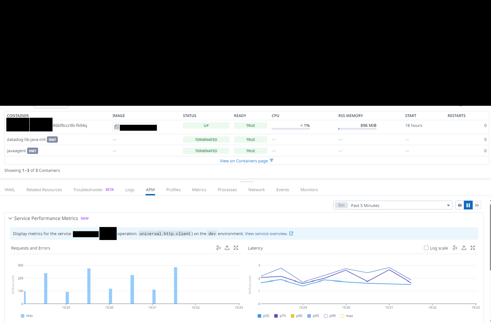
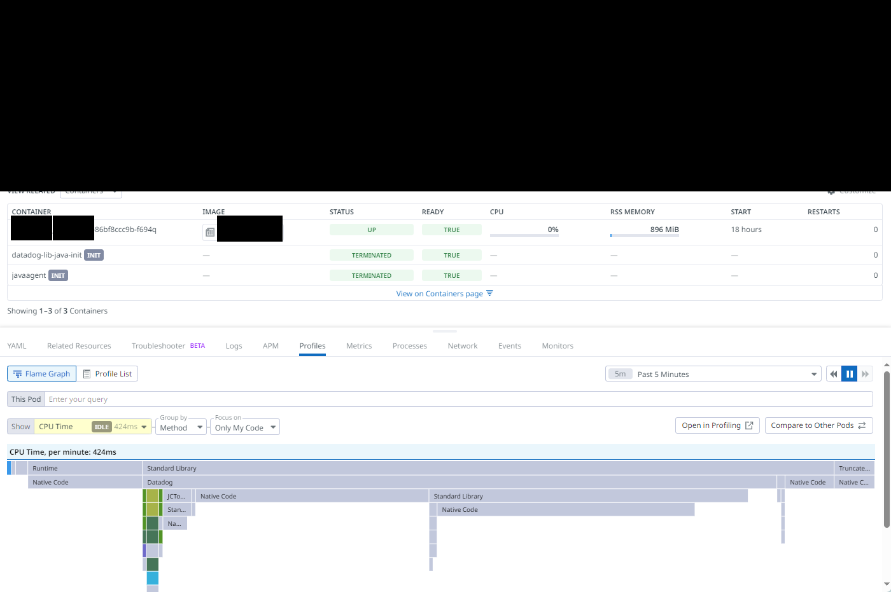

# Instrumentalizar una aplicación de spring boot con Datadog

1. [Introducción](#introducción)
2. [Requisitos](#requisitos)
3. [PoC con configuración de librerías a inyectar (no recomendable)](#poc-con-configuración-de-librerías-a-inyectar-no-recomendable)
4. [PoC con inyección automática de librerías (recomendable)](#poc-con-inyección-automática-de-librerías-recomendable)
5. [Pruebas de la aplicación con curl](#pruebas-de-la-aplicación-con-curl)
6. [Capturas de pantalla](#capturas-de-pantalla)
7. [Referencias](#referencias)

## Introducción

[Esta es la aplicación demo](https://github.com/DataDog/springblog) referenciada en [este documento de Datadog](https://docs.datadoghq.com/tracing/guide/tutorial-enable-java-admission-controller/), utilizada como prueba de concepto para validar una configuración correcta del APM de Datadog en Openshift. 

La configuración de logs con ```dd.trace_id``` y ```dd.span_id```[^1] está disponible en un [application.yml](https://github.com/DataDog/springblog/blob/main/demo-app/src/main/resources/application.yml) correspondiente a [spring boot logging configuration](https://howtodoinjava.com/spring-boot/configure-logging-application-yml/):

```yaml
logging:
  level:
    root: info
    org.springframework.web: INFO
  pattern:
    file: "%d{yyyy-MM-dd HH:mm:ss} [%thread] %-5level %logger{36} - %X{dd.trace_id} %X{dd.span_id} - %msg%n"
#    file: "%d{yyyy-MM-dd HH:mm:ss} %magenta([%thread]) %highlight(%-5level) %yellow(%logger{36}) - %X{dd.trace_id} %X{dd.span_id} - %msg%n"
#    console: "%d{yyyy-MM-dd HH:mm:ss} %magenta([%thread]) %highlight(%-5level) %yellow(%logger{36}) - %X{dd.trace_id} %X{dd.span_id} - %msg%n"
    console: "%d{yyyy-MM-dd HH:mm:ss} [%thread] %-5level %logger{36} - %X{dd.trace_id} %X{dd.span_id} - %msg%n"
  file:
    name: ${logging.file.path}/demo-app.log
    path: logs
```

Destacar que en MyOrg hemos configurado *Datadog Admission Controller* para permitir la inyección automática de librerías de trazas APM, siéndo ésta la configuración recomendable.

[^1]: https://docs.datadoghq.com/tracing/other_telemetry/connect_logs_and_traces/java

## Requisitos

Lista de requisitos previos al despliegue de la aplicación con la que vamos a probar el APM de Datadog:

1. Crear el namespace ```datadog-demo```, previamente añadido por nosotros a los manifiestos de esta PoC.
2. Apertura en el firewall para que *openshift on-prem* sea capaz de descargar las librerías de trazabilidad de datadog (disponible en dtdg.com que apunta a un repo público de github).
3. Habilitar la inyección automática de trazas en el *Admission Controller* de *Datadog Cluster Agent*.

## PoC con configuración de librerías a inyectar (no recomendable)

Manifiesto de aplicación a instrumentalizar disponible en [k8s/depl-with-lib-conf.yaml](k8s/depl-with-lib-conf.yaml), donde ha sido necesario actualizar el método de descarga del *java tracer* con un:

```curl -Lo /work-dir/dd-java-agent.jar https://dtdg.co/latest-java-tracer```

Nota: ha sido necesario desbloquear esta ruta de acceso en el firewall para que nuestro openshift on-prem sea capaz de descargar este artefacto de internet (disponible en github).

Despliegue de la aplicación:

```oc apply -f k8s/depl-with-lib-conf.yaml```

Borrado de la aplicación:

```oc delete -f k8s/depl-with-lib-conf.yaml```

## PoC con inyección automática de librerías (recomendable)

Manifiesto de aplicación a instrumentalizar disponible en [k8s/depl-with-lib-inj.yaml](k8s/depl-with-lib-inj.yaml)

Despliegue de la aplicación:

```oc apply -f k8s/depl-with-lib-inj.yaml```

Borrado de la aplicación:

```oc delete -f k8s/depl-with-lib-inj.yaml```

## Pruebas de la aplicación con curl

Tal y como se indica [en esta referencia](https://github.com/DataDog/springblog?tab=readme-ov-file#testing-the-application), lanzamos un ```curl``` hacia el endpoint de openshift donde exponemos nuestro frontend con un ```openshift route```:

```bash
for i in {1..100}; do
  echo "$i"
  curl http://springfront-datadog-demo.apps.cluster.example.com/upstream
done
```

## Capturas de pantalla





## Referencias

- https://docs.datadoghq.com/tracing/guide/tutorial-enable-java-admission-controller/
