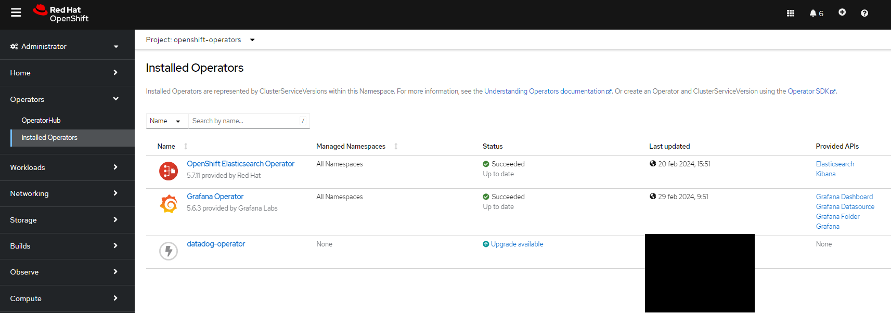
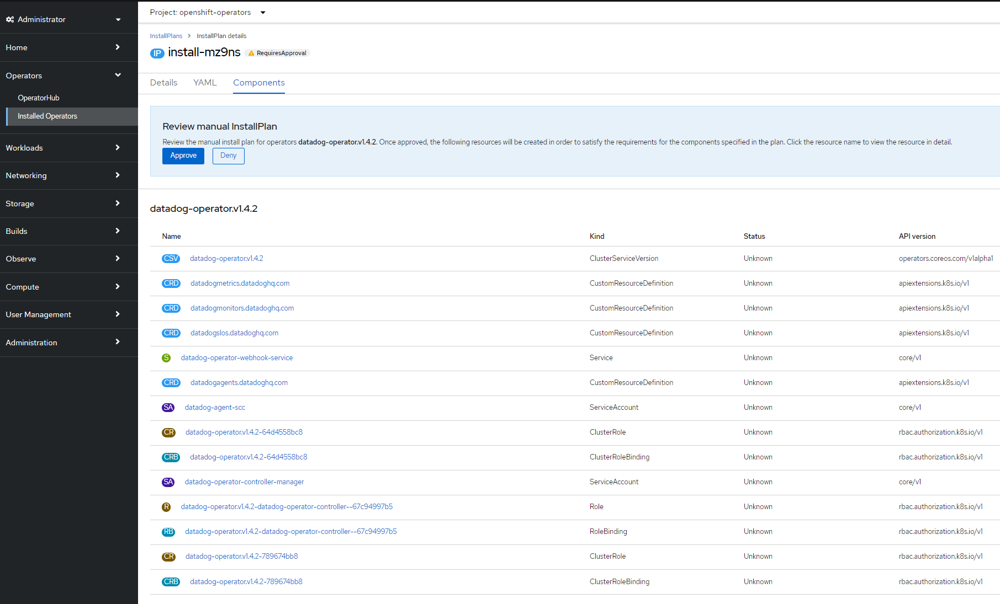
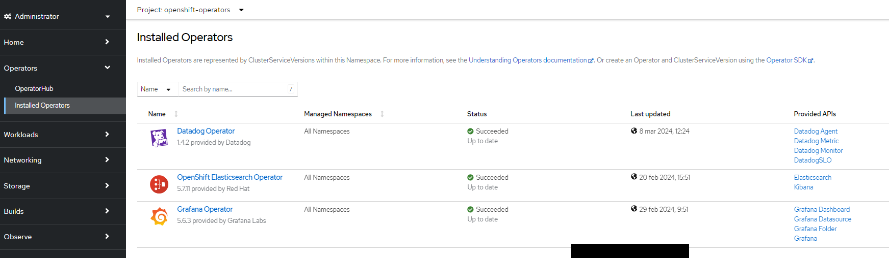

# Solution 2. Datadog Operator on OpenShift

> [!IMPORTANT]
> **Spanish Version / Versión en Español**:
> Este repositorio cuenta con una versión original en español redactada manualmente sin el uso de IA: [README-Spanish.md](README-Spanish.md).
>
> **English Version**:
> This English documentation (`README.md`) is a translation of the original Spanish version.

---

1. [Introduction](#introduction)
2. [Datadog Operator vs. Helm chart](#datadog-operator-vs-helm-chart)
3. [Prerequisites](#prerequisites)
4. [Datadog Operator Installation Procedure](#datadog-operator-installation-procedure)
   1. [Option 1. Datadog Operator Installation via OpenShift Marketplace](#option-1-datadog-operator-installation-via-openshift-marketplace)
   2. [Option 2. Datadog Operator Installation and Update via Helm Chart](#option-2-datadog-operator-installation-and-update-via-helm-chart)
   3. [Option 3. Datadog Operator Installation and Update via Operator Lifecycle Manager](#option-3-datadog-operator-installation-and-update-via-operator-lifecycle-manager)
5. [Datadog Agent Manifest Installation and Update Procedure](#datadog-agent-manifest-installation-and-update-procedure)
6. [References](#references)

## Introduction

Procedure for installing and configuring the [**Datadog Operator**](https://operatorhub.io/operator/datadog-operator), which automatically manages the **Datadog Agent** on OpenShift.

## Datadog Operator vs. Helm chart

You can also use the official Datadog Helm chart or a DaemonSet to install the Datadog Agent on Kubernetes. However, using the Datadog Operator offers the following advantages:

- The Operator has built-in defaults based on Datadog best practices.
- Operator configuration is more flexible for future enhancements.
- As a Kubernetes Operator, the Datadog Operator is treated as a first-class resource by the Kubernetes API.
- Unlike the Helm chart, the Operator is included in the Kubernetes reconciliation loop.

Datadog fully supports using a DaemonSet to deploy the Agent, but manual DaemonSet configuration leaves significant room for error. Therefore, using a DaemonSet is not highly recommended.

## Prerequisites

- Datadog Cloud user account with API-Key (required) and app-key (optional)

## Datadog Operator Installation Procedure

There are three installation methods:
1. [ ] Through OpenShift Marketplace, with the Datadog Operator being installed in the *openshift-operators* namespace.
2. [ ] Through the Datadog Operator Helm Chart, with the Datadog Operator being installed in the *datadog* namespace (for example).
3. [x] Through Operator Lifecycle Manager (OLM). **This is the installation method implemented at MyOrg.**

### Option 1. Datadog Operator Installation via OpenShift Marketplace

Deploy the *Datadog Operator* available in the OpenShift Marketplace with one click and create a Kubernetes secret with the Datadog API Key:

1. [*Deploy the Datadog Operator in an OpenShift cluster*](https://github.com/DataDog/datadog-operator/blob/main/docs/install-openshift.md)
2. ```oc create secret -n openshift-operators generic datadog-secret --from-literal api-key=<> --from-literal app-key=<>```

### Option 2. Datadog Operator Installation and Update via Helm Chart

Create a Kubernetes secret with the Datadog API Key and deploy the [Datadog Operator](https://operatorhub.io/operator/datadog-operator) Helm Chart with the following [values.yaml](datadog-operator-helm-chart/values.yaml):

1. ```oc create secret -n openshift-operators generic datadog-secret --from-literal api-key=<> --from-literal app-key=<>```
4. ```helm install datadog-operator datadog/datadog-operator -n openshift-operators -f ./values.yaml```
5. ```helm ls -A```

Updating the Datadog Operator via Helm Chart:

```helm upgrade datadog-operator datadog/datadog-operator -n openshift-operators -f ./values.yaml```

Uninstalling the Datadog Operator via Helm Chart:

```helm uninstall datadog-operator -n openshift-operators```

### Option 3. Datadog Operator Installation and Update via Operator Lifecycle Manager

Create a Kubernetes secret with the Datadog API Key and deploy the [Datadog Operator](https://operatorhub.io/operator/datadog-operator) via [Operator Lifecycle Manager](https://github.com/DataDog/datadog-operator/blob/main/docs/installation.md#install-the-datadog-operator-with-operator-lifecycle-manager) using the Datadog operator subscription manifest [olm.yaml](datadog-operator-helm-chart/olm.yaml):

1. ```oc create secret -n openshift-operators generic datadog-secret --from-literal api-key=<> --from-literal app-key=<>```
2. ```oc apply -f operatorhubio-catalog.yaml```
3. ```oc get catalogsource -A```
4. ```oc apply -f datadog-olm.yaml```
5. ```oc get subs -A```
6. ```oc get csv -n openshift-operators```





## Datadog Agent Manifest Installation and Update Procedure

Once the Datadog Operator has been installed using one of the two existing methods, you can proceed to deploy the Datadog Agent using the [datadog-agent-on-openshift.yaml](datadog-agent-on-openshift.yaml) manifest, which utilizes the CRDs created by the operator:

```oc apply -f ./datadog-agent-on-openshift.yaml```

Subsequently, it will be necessary to apply the following [scc.yaml](scc.yaml) manifest of the *SecurityContextConstraints* class to enable the full set of Datadog Agent features.

```oc apply -f scc.yaml```

Uninstallation:

```oc delete -f ./datadog-agent-on-openshift.yaml; oc delete -f scc.yaml```

## References

- https://docs.datadoghq.com/getting_started/containers/datadog_operator/
- https://artifacthub.io/packages/helm/datadog/datadog-operator
- https://github.com/DataDog/helm-charts/blob/main/charts/datadog-operator/values.yaml
- https://operatorhub.io/operator/datadog-operator
